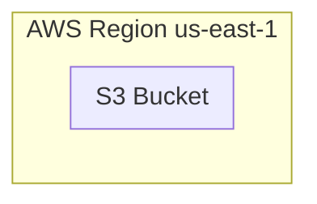

Let's create a good ol' HTML/JavaScript website and host it in AWS S3.
There are plenty of use cases for having your own website - for documentation, resumes,
or even HTML templates to share with the world!

{/* truncate */}

But to do that, we need to host the website somewhere anyone can access it.
AWS S3 is one such place, but the problem with anything AWS is - you need to setup the infrastructure,
and infrastructure is overwhelming.

In this tutorial we will create and deploy a fully functional static website to AWS S3 in just a few minutes,
with minimal configuration and zero infrastructure expertise.
We'll walk you through creating your first website using **Octo** -
a powerful infrastructure-as-code framework that abstracts away the complexity of cloud resources.

By the end of this guide you'll have a live website running on AWS.

## What We'll Accomplish
Today, we're going to:
- **Create a static website infrastructure** using Octo's pre-built templates.
- **Deploy local code to AWS S3** with just a few commands.
- **Learn to clean up resources** when you're done.

The best part? You don't need to be an AWS expert or infrastructure guru. Octo handles all the heavy lifting for you.

:::info
There are advanced tutorials on how to create a CD Pipeline such that every time you push your changes to
a VCS like GitHub, the website is automatically rebuilt and the changes are published.
These tutorials are part of a different blog post.
We will keep things simple in this one.
:::

:::info
Once your website is available, you will notice that your website URL is autogenerated.
This is not a friendly name!
There is a separate blog post on how to set up DNS, HTTPS, and CloudFront for your website.
:::

## Prerequisites
Before we dive in, make sure you have the basics covered.
If you haven't already, check out our [installation guide](/docs/getting-started/installation) to set up:
- **Node.js** (version 22.x or higher)
- **AWS CLI** (version 2.x or higher) with your credentials configured

Once you're all set up, we're ready to create some magic! ✨

## Architecture


This is a very simple architecture.
We are going to create a S3 bucket inside one of the AWS regions - `us-east-1`.
The bucket will be configured automatically to be used as a website, and not a storage service.

Then, our local HTML files will be pushed to this bucket,
and our website will be ready.

## Let's Begin 🚀
### Setup
Create a new Octo application.<br />
Octo comes with several pre-configured templates that makes getting started incredibly easy.
For our website, we'll use the `aws-s3-website` template.

Open your terminal and run these commands.
```bash
# Create a new directory "my-awesome-website" in your current location
# and set up a new Octo app using the "aws-s3-website" template.
npx @quadnix/octo-build create-app -t aws-s3-website -n my-awesome-website -p .

# Navigate into your new project.
cd my-awesome-website

# Install the dependencies.
npm install
```

At the root of the project, you will find `octo.yaml` file.
This is where your infrastructure is pre-defined.
The file will look similar to code below.
```yaml title="octo.yaml"
...

version: 1

env:
  - key: AWS_ACCOUNT_ID
    kind: string
    value: "123456789123"
  - key: AWS_S3_WEBSITE_BUCKET_NAME
    kind: string
    value: my-website-unique-bucket

settings:
  ...

imports:
  ...

modules:
  ...
```

:::warning
This blog post is not a tutorial for Octo,
hence we won't go into too much details on how Octo works, what different settings and modules mean,
and so on.

If you are interested in diving deeper, please checkout our documentation.
:::

Before we can deploy anything, we need to tell Octo about your AWS account and give your S3 bucket a unique name.
Edit the `env` keys in `octo.yaml`.
```yaml title="octo.yaml"
env:
  - key: AWS_ACCOUNT_ID
    kind: string
    value: "123456789123" # Change me.
  - key: AWS_S3_WEBSITE_BUCKET_NAME
    kind: string
    value: my-website-unique-bucket # Change me.
```

:::tip
Make sure your bucket name is unique! S3 bucket names are globally unique across all AWS accounts.
:::

### Deploy
The root of your website project also contains some HTML files in the `website` directory.
These HTML files will be deployed to the S3 bucket.
You can change them to your liking.

Now for the exciting part - let's deploy your website! This is where Octo really shines.
Open the terminal again and run the `octo` command.
```bash
# First create a lock.
node_modules/.bin/octo state lock -d octo.yaml

# Then copy the lock output, a random unique string, and run the app with the lock ID.
OCTO_APP_LOCK_ID=<lock_id> node_modules/.bin/octo run -d octo.yaml

# Lastly, unlock the app.
node_modules/.bin/octo state unlock <lock_id> -d octo.yaml
```

Sit back and watch the magic happen! Octo will:
1. **Connect to your AWS account** using your configured credentials.
2. **Create an S3 bucket** with the name you specified.
3. **Configure the bucket** for static website hosting.
4. **Upload your website files** to the bucket.
5. **Generate a detailed report** of everything that was created.

Once the deployment is complete, you'll see the URLs where your website is now live! Visit these URLs in your browser.
```bash
http://<your-bucket-name>.s3-website-us-east-1.amazonaws.com/index.html
http://<your-bucket-name>.s3-website-us-east-1.amazonaws.com/error.html
```

Congratulations! 🎉 You've just deployed your first website to AWS without writing a single line of infrastructure code.

If you run the deployment steps again, Octo will detect that your website already exists and won't recreate it.
If you modify your HTML files and re-run, Octo will intelligently detect the changes and only upload the modified files.
Pretty cool, right?

## Cleaning Up
When you're ready to clean up your resources (and avoid any AWS charges), Octo makes it just as easy:

1. **Edit your `octo.yaml`** file.
2. **Comment out the S3 website module** (keep the app and account modules).
3. **Re-run** the deploy steps.

```yaml title="octo.yaml"
...

modules:
  - moduleId: app-module
    moduleClass: SimpleAppModule
    moduleInputs:
      name: aws-s3-website

  - moduleId: account-module
    moduleClass: AwsIniAccountModule
    moduleInputs:
      accountId: "${env.AWS_ACCOUNT_ID}"
      app: "${{app-module.model.app}}"

  #- moduleId: s3-website-service-module
  #  moduleClass: AwsS3StaticWebsiteServiceModule
  #  moduleInputs:
  #    account: "${{account-module.model.account}}"
  #    awsRegionId: us-east-1
  #    bucketName: "${env.AWS_S3_WEBSITE_BUCKET_NAME}"
  #    directoryPath: website
```

Then re-run the deploy steps.
```bash
# First create a lock.
node_modules/.bin/octo state lock -d octo.yaml

# Then copy the lock output, a random unique string, and run the app with the lock ID.
OCTO_APP_LOCK_ID=<lock_id> node_modules/.bin/octo run -d octo.yaml

# Lastly, unlock the app.
node_modules/.bin/octo state unlock <lock_id> -d octo.yaml
```

Finally, delete your project directory.
```bash
rm -rf my-awesome-website
```

## Why This Matters
What you just accomplished would typically require:
- Understanding S3 bucket policies.
- Configuring static website hosting settings.
- Managing file uploads and permissions.
- Handling error pages and redirects.
- Tracking infrastructure state manually.

With Octo, you got all of this for free, plus:
- Automatic state management.
- Change detection and incremental updates.
- Detailed reporting and audit trails.
- Easy cleanup and resource management.

Octo's philosophy is simple: **infrastructure should be as easy to manage as your application code**.
By abstracting away the complexity of cloud resources,
Octo lets you focus on what matters most - building great applications.

Ready to dive deeper?
Check out our [fundamentals documentation](/docs/fundamentals/models) to learn more about how Octo works under the hood.

Happy building! 🚀
