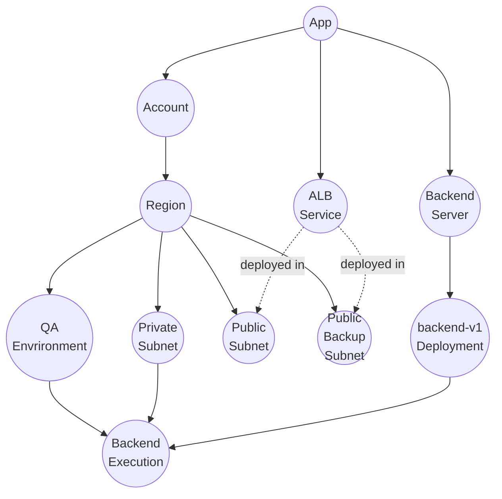

Ready to take your infrastructure to the next level?

Any advanced website requires backend and API servers, databases, and loads of other AWS resources.
Setting up this infrastructure can be a daunting task.
What if I told you that you could deploy a production-ready containerized server on AWS ECS
with a load balancer, VPC, security groups, and multi-AZ setup in just a few minutes?

{/* truncate */}

In this tutorial, we'll walk through deploying a scalable ECS server using **Octo** -
a powerful infrastructure-as-code framework that makes complex cloud architectures surprisingly simple.
By the end of this guide, you'll have a fully functional containerized application
running behind an Application Load Balancer with enterprise-grade networking and security.

## What We'll Accomplish
Today, we're going to:
- **Deploy a containerized server** using AWS ECS with Fargate.
- **Set up a complete VPC** with public and private subnets across multiple availability zones.
- **Configure an Application Load Balancer** with health checks and target groups.
- **Implement security groups** and network isolation.
- **Learn to clean up resources** when you're done.

The best part? You don't need to be a networking expert or container orchestration guru.
Octo handles all the complex AWS resource relationships for you.

:::info
There are advanced tutorials on how to create a CD Pipeline such that every time you push your changes to
a VCS like GitHub, the latest server is automatically rebuilt and the changes are deployed.
These tutorials are part of a different blog post.
We will keep things simple in this one.
:::

## Prerequisites
Before we dive in, make sure you have the basics covered.
If you haven't already, check out our [installation guide](/docs/getting-started/installation) to set up:
- **Node.js** (version 22.x or higher)
- **AWS CLI** (version 2.x or higher) with your credentials configured

Once you're all set up, we're ready to build some serious infrastructure! 🚀

## Architecture


At a high level, we want to run our backend server in a container running in ECS Fargate.
The backend server must run in a private subnet to prevent unwanted access.
An ALB is required in a public subnet for requests to come in,
and the ALB should forward those requests to the backend server.

The infrastructure can be shown as a model graph.
> A model graph in Octo is a standard set of nodes and edges that helps visualize the infrastructure layout.
> You can learn more about them in the documentation.



From AWS's perspective, Octo will be creating below resources.
- ALB, ALB Listeners, ALB Target Groups.
- ECS Cluster, ECS Service, ECS Task Definition.
- IAM Role.
- VPC, Internet Gateway, NAT Gateway, NACLs, Route Tables, Security Groups, Subnets.

:::tip
Octo determines which resources to create in what order through the instructions given by modules.
If these concepts are unfamiliar to you, we recommend reading up on our documentation to get started.
:::

## Let's Begin 🚀
### Setup
Let's start by creating a new Octo application using the `aws-ecs-server` template.
This template sets up a complete containerized server infrastructure with all the bells and whistles.

Open your terminal and run these commands.
```bash
# Create a new directory "my-ecs-server" in your current location
# and set up a new Octo app using the "aws-ecs-server" template.
npx @quadnix/octo-build create-app -t aws-ecs-server -n my-ecs-server -p .

# Navigate into your new project
cd my-ecs-server

# Install the dependencies
npm install
```

At the root of the project, you will find `octo.yaml` file.
This is where your infrastructure is pre-defined.
The file will look similar to code below.
```yaml title="octo.yaml"
...

version: 1

env:
  - key: AWS_ACCOUNT_ID
    kind: string
    value: "123456789123"

settings:
  ...

imports:
  ...

modules:
  ...
```

:::warning
This blog post is not a tutorial for Octo,
hence we won't go into too much details on how Octo works, what different settings and modules mean,
and so on.

If you are interested in diving deeper, please check out our documentation.
:::

Before we can deploy anything, we need to tell Octo about your AWS account.
Edit the `env` keys in `octo.yaml`.
```yaml title="octo.yaml"
env:
  - key: AWS_ACCOUNT_ID
    kind: string
    value: "123456789123" # Change me.
```

:::tip
The ECS template is designed to be production-ready out of the box.
It creates resources in `us-east-1` with a specific VPC CIDR block (`10.0.0.0/16`).
If you need to customize the region or networking, you can modify the `octo.yaml` file accordingly.
:::

### Deploy
Now for the exciting part - let's deploy your complete ECS infrastructure!
This is where Octo really shows its power in orchestrating complex multiservice architectures.
Open the terminal again and run the `octo` command.
```bash
# First create a lock.
node_modules/.bin/octo state lock -d octo.yaml

# Then copy the lock output, a random unique string, and run the app with the lock ID.
OCTO_APP_LOCK_ID=<lock_id> node_modules/.bin/octo run -d octo.yaml

# Lastly, unlock the app.
node_modules/.bin/octo state unlock <lock_id> -d octo.yaml
```

Sit back and watch the magic happen! Octo will create:
1. **VPC and Networking** - A complete virtual private cloud with public and private subnets.
2. **ECS Cluster** - A serverless Fargate cluster for running containers.
3. **Application Load Balancer** - With health checks and target groups.
4. **Security Groups** - Proper network isolation and access controls.
5. **Container Service** - Running a sample echo server application.
6. **Multi-AZ Setup** - High availability across multiple availability zones.

### Access Your Live Server
Once the deployment is complete, you'll see the ALB DNS name in the HTML report output or in your AWS console.
Your containerized server is now live and accessible through the load balancer!

Within the HTML report, you can find your ALB DNS name under
`@octo/alb=alb-region-module-app-region-east-qa-api-alb` resource.<br/>
The `DNSName` key looks like `qa-api-alb-<random_id>.us-east-1.elb.amazonaws.com`.

Visit this URL in your browser:
```bash
http://qa-api-alb-<random_id>.us-east-1.elb.amazonaws.com
```

You should see a response from the echo server, confirming that your ECS infrastructure is working perfectly!

Congratulations! 🎉 You've just deployed your backend server in AWS
without writing a single line of infrastructure code.

If you run the deployment steps again, Octo will detect that your infrastructure already exists and won't recreate it.
If you modify the `octo.yaml` file and re-run, Octo will intelligently detect and apply the changes.
Pretty cool, right?

## HTML Reports
After each deployment, Octo generates a comprehensive HTML report showing exactly what infrastructure was created.
You'll find this report in your project root directory - open it in any web browser to see:
- All AWS resources that were created.
- Resource relationships and dependencies.
- Configuration details for each component.

This report is invaluable for understanding your infrastructure and ensuring everything was deployed correctly.

## Customizing Your ECS Server
The template comes with a sample echo server, but you can easily customize it for your own application.

### Changing the Container Image
Edit the `octo.yaml` file and modify the deployment configuration.
```yaml title="octo.yaml"
...
  
modules:
  ...
    
  - moduleId: backend-deployment-v1-module
    moduleClass: AwsEcsDeploymentModule
    moduleInputs:
      deploymentContainerProperties:
        cpu: 256 # Increase CPU if needed
        image:
          command: npm start # Your application command
          ports:
            - containerPort: 80 # Your app port
              protocol: tcp
          uri: docker.io/strm/helloworld-http:latest # <-- We changed the container image!
        memory: 512 # Increase memory if needed
      deploymentTag: v1
      server: "${{backend-server-module.model.server}}"
  
  ...
```

### Scaling Your Application
You can also easily scale your application by modifying the desired count.
```yaml title="octo.yaml"
...

modules:
  - moduleId: backend-v1-qa-execution-module
    moduleClass: AwsEcsExecutionModule
    moduleInputs:
      ...
      
      desiredCount: 3 # Scaled to 3 instances.

      ...
```

:::info
Let's again redeploy the app using `octo run` command.
The HTML report will show you the changes you made.

Heading in the AWS console, you will see that the task definition has been updated,
and momentarily ECS server will start to pick up the new task definition.
Wait for the new task to run, and then head over again to your ALB URL and refresh the page.
You should now see responses coming from your new server!
:::

## Cleaning Up
When you're ready to clean up your resources (and avoid AWS charges), Octo makes it straightforward:

1. **Edit your `octo.yaml`** file.
2. **Comment out all modules except the app and account modules**.
3. **Re-run** the deploy steps.

```yaml title="octo.yaml"
...

modules:
  - moduleId: app-module
    moduleClass: SimpleAppModule
    moduleInputs:
      name: aws-s3-website

  - moduleId: account-module
    moduleClass: AwsIniAccountModule
    moduleInputs:
      accountId: "${env.AWS_ACCOUNT_ID}"
      app: "${{app-module.model.app}}"

  ... # Rest of modules commented out.
```

Then re-run the deploy steps.
```bash
# First create a lock.
node_modules/.bin/octo state lock -d octo.yaml

# Then copy the lock output, a random unique string, and run the app with the lock ID.
OCTO_APP_LOCK_ID=<lock_id> node_modules/.bin/octo run -d octo.yaml

# Lastly, unlock the app.
node_modules/.bin/octo state unlock <lock_id> -d octo.yaml
```

Finally, delete your project directory.
```bash
rm -rf my-ecs-server
```

:::warning
Deleting AWS resources takes time since Octo has to wait for confirmation from NAT Gateway and various other resources.
AWS takes time to clean up resources and release IP addresses.
In certain cases, the cleanup has been known to take >20 minutes.
:::

:::danger
Octo is still in its early phases, so if you encounter a bug creating or deleting resources,
please help us by opening an issue on GitHub.

In worst case, to avoid unwanted AWS charges, reference the HTML report and manually delete the resources.
:::

## Why This Matters
What you just accomplished would typically require:
- Deep understanding of VPC networking and subnet design.
- Knowledge of ECS task definitions and service configurations.
- Experience with Application Load Balancer setup and health checks.
- Understanding of security groups and network ACLs.
- Manual coordination of resource dependencies and timing.

With Octo, you got all of this for free, plus:
- Automatic resource orchestration and dependency management.
- Built-in best practices for security and networking.
- State management and change detection.
- Detailed reporting and audit trails.
- Easy cleanup and resource management.

Octo's philosophy is simple: **complex infrastructure should be as manageable as your application code**.
By abstracting away the complexity of cloud resource orchestration,
Octo lets you focus on what matters most - building great applications.

Ready to dive deeper?
Check out our [fundamentals documentation](/docs/fundamentals/models) to learn more about how Octo works under the hood.

Happy containerizing! 🐳
