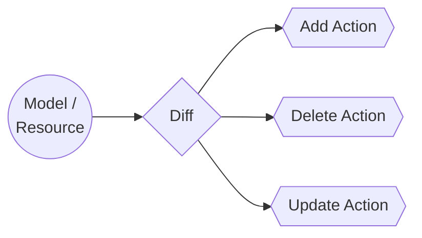

## Definition
An action is how things get done in Octo.
Octo operates by comparing the previous state of the app with the new state, generating tasks to be completed.
These tasks can be of three types: **add**, **delete**, or **update**.
Each of these tasks can be defined atomically using `Actions`.

In general, an action completes task, and many eligible entities can define Actions.
The 2 entities you know so far are - Models, and Resources.
A model diff is handed by a Model Action, whereas a resource diff is handed by a Resource Action.
There are more entities that can generate actions, such as Overlays, which we have discussed later in this documentation.



## Anatomy
An action belongs to an entity, consists of a set of inputs, and can generate outputs.

```js title="Action Schema"
{
  collectInput(): "a method that defines what inputs does the action rely upon.",
  filter(): "a method that defines the conditions when the action must run.",
  handle(): "a method that contains the action logic. It also produces outputs.",
  revert(): "a method that is the logical opposite of handle(), i.e. reverts the actions performed to its previous state."
}
```

## Back to code
Looking back at the code we wrote in the [Getting Started](/docs/getting-started.mdx) guide,
```js
const diffs1 = await octoAws.diff(app);
const generator1 = await octoAws.beginTransaction(diffs1);
```
* The `diff()` generates the action tasks.
* A new transaction is started using `beginTransaction()`.
* Which finds and runs appropriate model actions using the `handle()` method.
* Those model actions produce resources.
* A resource diff is automatically taken to produce new action tasks.
* Within the same transaction, appropriate resource actions are found and run using the `handle()` method.

:::info[Revert]
In case the transaction is reverted, the same sequence applies,
but uses the `revert()` methods instead of the "handle()" methods.
:::

## Summary
Here, we've explored Actions. This is where the "it" happens.
Most of the custom logic that makes up **your** infrastructure, will happen in your Action files.
