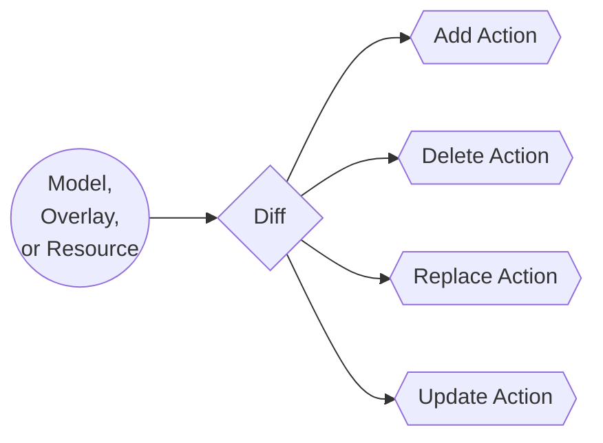

import Tabs from '@theme/Tabs';
import TabItem from '@theme/TabItem';

## Definition
An action can be a model action, an overlay action, or a resource action.

An action is how things get done in Octo.
Octo operates by comparing the previous state of a graph with the new state, collecting actions to be executed.
These actions can be one of these types: **add**, **delete**, **update**, or **replace**.

:::info
* A model or overly action manipulates resources, i.e. they transform a model definition into a set of resources.
  * E.g. transforming a Region model into a VPC and an Internet Gateway resource.
* A resource action manipulates the real infrastructure atomically,
i.e. they transform a resource definition to manipulate the real infrastructure using CDK or HTTP requests.
  * E.g. transforming a VPC resource into a real VPC in AWS, and provisioning a real Internet Gateway in AWS.
:::

:::tip
A resource action should ideally be *atomic*, i.e. they should do a single task.
They don't need to be idempotent though,
as Octo will ensure that they are executed in order, one at a time, and only if needed based on the diff.
:::



## Node-Action Relationship
A node has `1 : N` relationship with actions, i.e.
an action is always bound to a single node, but a node can have multiple actions.
Their relationship is defined in code, where the action is being defined, using the `@Action` decorator.

<Tabs>
  <TabItem value="modelAction" label="Model Action">
    Here the `AddSimpleAppModelAction` action is bound to the App model node,
    and will only be executed on a qualifying diff of the App node.
    ```typescript
    @Action(App)
    export class AddSimpleAppModelAction implements IModelAction<SimpleAppModule> {
      // implementation.
    }
    ```
  </TabItem>
  <TabItem value="resourceAction" label="Resource Action">
    Here the `AddVpcResourceAction` action is bound to the Vpc resource node,
    and will only be executed on a qualifying diff of the Vpc node.
    ```typescript
    @Action(Vpc)
    export class AddVpcResourceAction implements IResourceAction<Vpc> {
      // implementation.
    }
    ```
  </TabItem>
</Tabs>

## Anatomy
An action primarily consists of 2 methods - `filter()` and `handle()`.

- **Filter**: In this method action defines the conditions when it must run, e.g.
the action must run if the resource is being added, or it must run if a particular property has been updated.
- **Handle**: In this method the action must implement the actual logic, handle retries, and produce outputs.
If an action throws an error, it immediately fails the transaction and Octo captures the current state for the next run.
```typescript title="Action Schema"
{
  filter() // A method that defines the conditions when the action must run.
  handle() // A method that contains the action logic. It also produces outputs.
}
```

## Summary
In this section we've explored Actions. This is where the "it" happens.
Most of the logic that makes up your infrastructure will happen in these Action files.
We've also discussed why Actions are the most likely place to throw errors, and can cause transactions to fail.
