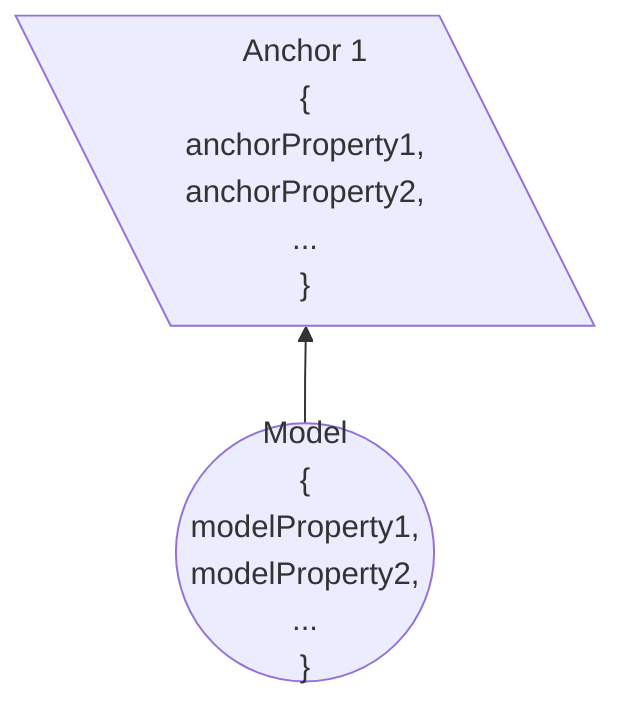
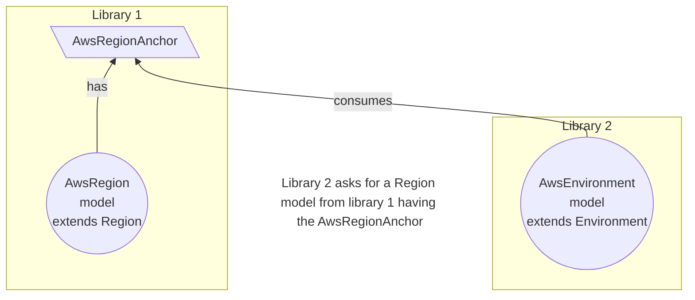

## Introduction
An anchor is a property on the model or overlay node.
It is typically used to define a signature of the model node, and exposes one or more properties of the node.
You should think of an anchor as the "representative" of the model.



## Anchors for sharing models
Octo defines a set of base models - App, Account, Region, etc.
These models are intentionally generic. Frequently, individual implementation libraries will re-create these base models
to add more properties to better represent the infrastructure being encapsulated.

E.g. a Region model, in octo-aws-cdk, is re-created as `AwsRegion` containing the name of the AWS region - us-east-1.
If this model was to be shared outside the library, other libraries become dependent on this exact definition.
This makes it difficult for this model to be updated.

Instead, models are expected to be hidden as an internal implementation detail.<br/>
**On model's behalf, its anchors are exposed.**

Other libraries can now consume models using the base libraries having this anchor.


This ensures that library 2 receives a Region model having the specific properties defined in the anchor, such as,
* Having an AWS based model.
* Having the name of the AWS region.

This is better than sharing the exact models whose definition is likely to evolve over time.

:::info
Anchor exposes portion of a model with a unique signature to be ingested by other libraries or components,
and is a substitute for the model for sharing purposes.
:::

## Anchors for overlays
Anchors are also the only components that overlays interact with.
Rather than ingesting the models (for reasons stated above), overlays are created with the anchors of the models.
Follow the link to learn more about [Overlays](/docs/fundamentals/overlays.mdx).

## Anchor-Model Relationship
An anchor can only be applied on a model or an overlay.

The relationship is defined by the `@Anchor` decorator.
Here a new example anchor `AwsRegionAnchor` is being defined for the `AwsRegion` model,
i.e. the anchor will be automatically added as a property on the `AwsRegion` model.

```typescript
@Anchor('<namespace>')
export class AwsRegionAnchor extends AAnchor<{ awsRegionId: string; type: 'AWS' }, AwsRegion> {
  constructor(
    anchorId: string,
    properties: { awsRegionId: string; type: 'AWS' },
    parent: AwsRegion,
  ) {
    super(anchorId, properties, parent);
  }
}
```

It exposes certain properties on the anchor, which makes up the unique signature of the anchor.
Other libraries, components, or overlays can consume this anchor and will get access to the properties,
while ensuring that the anchor is attached to a `Region` model.

## End-to-End Example

The following walkthrough shows the full lifecycle of an anchor:
**define it → attach it in a module → consume it in another module**.

### Step 1 — Define the anchor

Create an anchor class that exposes the subset of model properties other modules need.

```typescript title="aws-region.anchor.ts"
@Anchor('@my-cdk')
export class AwsRegionAnchor extends AAnchor<AwsRegionAnchorSchema, AwsRegion> {
  constructor(
    anchorId: string,
    properties: AwsRegionAnchorSchema['properties'],
    parent: AwsRegion,
  ) {
    super(anchorId, properties, parent);
  }
}
```

```typescript title="aws-region.anchor.schema.ts"
export class AwsRegionAnchorSchema extends BaseAnchorSchema {
  override properties = Schema<{
    awsRegionId: string;
    type: 'AWS';
  }>();
}
```

### Step 2 — Attach the anchor inside a module's `onInit()`

In the module that owns the `AwsRegion` model, create and attach the anchor after
constructing the model. Any module that receives this model as input can now
discover the anchor without importing `AwsRegion` directly.

```typescript title="aws-region.module.ts"
@Module('@my-cdk', AwsRegionModuleSchema)
export class AwsRegionModule extends AModule<AwsRegionModuleSchema, AwsRegion> {
  async onInit(inputs: AwsRegionModuleSchema): Promise<AwsRegion> {
    const region = new AwsRegion(inputs.awsRegionId);

    // Attach the anchor so other modules can consume it.
    region.addAnchor(
      new AwsRegionAnchor('AwsRegionAnchor', { awsRegionId: inputs.awsRegionId, type: 'AWS' }, region),
    );

    return region;
  }
}
```

### Step 3 — Consume the anchor in another module's schema

A consuming module declares that it needs *a model that has an `AwsRegionAnchor`*,
rather than importing `AwsRegion` directly. This keeps the two libraries decoupled.

```typescript title="aws-environment.module.schema.ts"
export class AwsEnvironmentModuleSchema extends ModuleSchema<AwsEnvironmentModule> {
  @Validate({
    isModel: {
      anchors: [{ schema: AwsRegionAnchorSchema }],
    },
  })
  region = Schema<AwsRegion>();
}
```

When Octo validates the schema it checks:
- The supplied model has at least one anchor that serialises as `AwsRegionAnchorSchema`.

This is safer than importing `AwsRegion` directly because:
- The environment module never takes a hard dependency on the region module's internal class.
- If the region module upgrades or renames `AwsRegion`, only the anchor schema contract matters.

:::info
See the [`@Anchor` decorator API reference](/api/octo/function/Anchor) and
the [`AAnchor` class reference](/api/octo/class/AAnchor) for full API details.
:::

## Summary
In this article we discussed Anchors, who can have them, and what purpose they serve.
Anchors make models shareable, and forms the basis of sharing information between different parts of the system.
