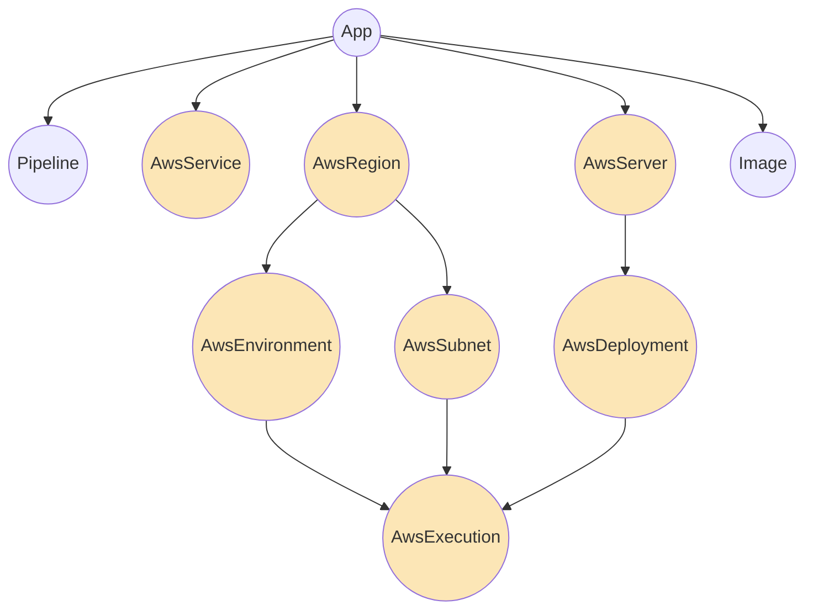

## Introduction
:::info[octo vs octo-aws-cdk]
Octo serves as the foundational `octo` library, defining the fundamental structure for general infrastructure.
It establishes a core set of models and functions for manipulating these models.

On the other hand, the `octo-aws-cdk` library is our specific implementation of Octo
tailored for the AWS cloud provider.
It builds upon the base Octo models, offering a pre-configured CDK for typical AWS infrastructure setups.

If your project requires more complex functionalities beyond what the `octo-aws-cdk` library offers,
you have the flexibility to further extend either the `octo` library or the `octo-aws-cdk` library
to meet your specific needs.
:::

## AWS Models
The `octo-aws-cdk` library overrides the highlighted Octo models below,
offering custom implementations tailored to support the AWS cloud provider.



To use one of these models instead of the default Octo model, simply replace it.
```typescript
// const region = new Region();
const region = new AwsRegion(RegionId.AWS_US_EAST_1A)
```

## Summary
We've covered Models and how we can extend them, such as with AWS Models for AWS cloud infrastructure.
But we haven't covered the internals of Models, or how to make one.
Those details will be covered gradually in later sections.
For now, think of Models simply as black boxes for encapsulating infrastructure components.
