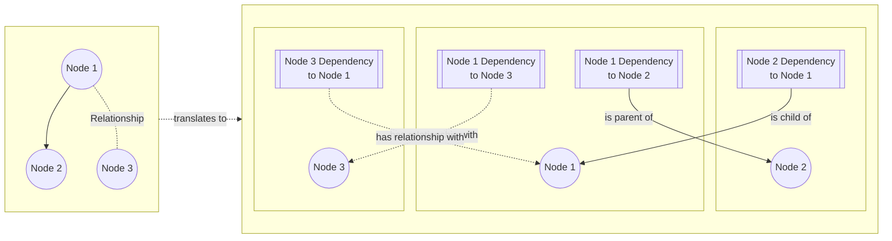

## Introduction
A dependency is the edge between two nodes that describes their relationship. It can be one of three types,
* **Parent**
<br/> A node is the parent of another node, meaning it must exist before the child node is created.
For example, an app is the parent of a region, so the app must exist before any region is created.
* **Child**
<br /> A node is the child of another node, meaning it will be deleted before the parent node is deleted.
For example, an environment is a child of a region, so all environments must be deleted before deleting the region.
* **Relationship**
<br /> A node has a relationship with another node that is neither a parent nor a child relationship.
For example, a server could have a relationship with an image.
The distinction between the "relationship" type and the "parent-child" type is that in a "relationship",
there is no obligation for either node to exist or be deleted before of the other node.

:::tip
* A parent-child dependency is bidirectional, i.e. if Node 1 is parent of Node 2,
then Node 2 must be a child of Node 1.
* A "Relationship" dependency is also bidirectional, i.e. if Node 1 has relationship with Node 2,
then Node 2 also has a relationship with Node 1.


:::

## Node
A node in Octo can be - a Model, a Resource, or an Overlay.<br />
In Octo code base, a node is represented as an extension of `ANode<I, T>`,
which is the base abstract class that Models, Resources, and Overlays inherit from.

## Dependency Class
A dependency is not stored as a property in node; instead, it is its own class as a first class citizen.
It encompasses two nodes on its either end.

```js title="Dependency Schema"
{
  from: "a node",
  to: "a node",
  relationship: "parent | child | relationship",
  behaviors: "an array of metadata with individual traits of this dependency."
}
```

A dependency is also serialized and deserialized just like other nodes.
Octo keeps track of all dependencies in a graph in the state files, and are diff-ed between runs.

## Summary
In this section we explored Dependencies.
Just as in a typical graph we have vetices and edges,
in Octo graphs, nodes are vertices and dependencies are edges.
A dependency is a first class citizen of Octo, and has its own dedicated class.
