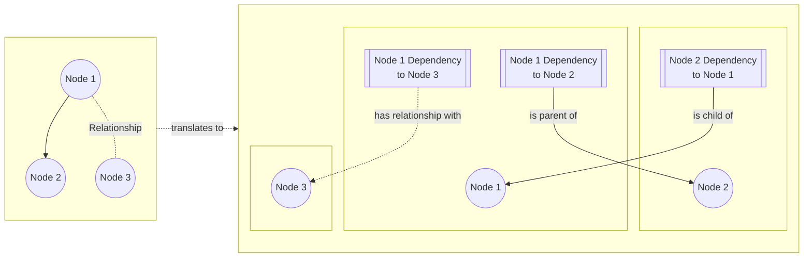

import { Brand } from '@site/src/components/brand';

## Definition
A dependency is a property of Node describing its relations to other nodes.
A dependency can be one of three types,
* **Parent**
<br/> Node is parent of another node, i.e. it will exist before child node gets created.
E.g. an App is a parent of Region, so an app must exist before any region is created.
* **Child**
<br /> Node is child of another node, i.e. it will be deleted before parent node gets deleted.
E.g. an Environment is a child of Region, so all environment(s) must be deleted before deleting the region.
* **Relationship**
<br /> Node has a relationship to another node that is neither parent nor child relationship.
E.g. a Server has relationship with an Image.
The only difference between the "relationship" type, vs "parent-child" type, is that in "relationship"
there is no obligation for either nodes to exist or be deleted because of the other node.
This constraint is explicitly expressed in the definition of the models.

E.g. the Server model constructor takes Image as an argument,
```typescript
constructor(serverKey: string, image: Image) {
  this.addRelationship('serverKey', image, 'imageId');
}
```
This enforces

:::tip
* A parent-child dependency is bi-directional, i.e. if Node 1 is parent of Node 2,
then Node 2 must be a child of Node 1.
* A "Relationship" dependency is uni-directional, i.e. if Node 1 has relationship with Node 2,
then it is not necessarily true that Node 2 also has a relationship with Node 1.
:::

