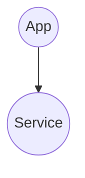

import { Brand } from '@site/src/components/brand';

## Introduction
The aim of this example is to demonstrate how easy it is to host a website in AWS S3 using <Brand/>.

For this, you will need,
* an AWS account
* <Brand codify format="lower" /> library.
* <Brand codify format="lower" variation="proj-aws-cdk" /> library.

## Overview


In order for us to generate the above infrastructure, we can write this code.
```typescript
import { dirname, join } from 'path';
import { fileURLToPath } from 'url';
import { App, LocalStateProvider } from '@quadnix/octo';
import { OctoAws, S3StaticWebsiteService } from '@quadnix/octo-aws-cdk';

const __dirname = dirname(fileURLToPath(import.meta.url));

const octo = new OctoAws();
await octo.initialize(new LocalStateProvider(__dirname));

const app = new App('test');
const s3StaticWebsiteService = new S3StaticWebsiteService('test-bucket');
app.addService(s3StaticWebsiteService);

const diffs = await octo.diff(app);
const generator = await octo.beginTransaction(diffs);

const modelTransactionResult = await generator.next();
await octoAws.commitTransaction(app, modelTransactionResult.value);
```

There is a lot to unpack here, so let's break it down.

```typescript
const octo = new OctoAws();
await octo.initialize(new LocalStateProvider(__dirname));
```
The first step is to instantiate the <Brand codify format="lower" variation="proj-aws-cdk" /> library,
and then to initialize it by passing a `StateProvider`.
We are using the `LocalStateProvider` which will store the state in a local file.

```typescript
const app = new App('test');
const s3StaticWebsiteService = new S3StaticWebsiteService('test-bucket');
app.addService(s3StaticWebsiteService);
```
Next, we create an <Brand codify format="lower" /> `App` and add a `Service` to it.
Notice, we are using the `S3StaticWebsiteService` which is provided by the
<Brand codify format="lower" variation="proj-aws-cdk" /> library.

```typescript
const diffs = await octo.diff(app);
const generator = await octo.beginTransaction(diffs);
```
Now, we call the in-built `diff()` method which generates the difference in infrastructure between an earlier state
and the current state. Since, we don't have a previous state, the diff would reflect adding a new S3 website.
We encourage you to stop your debugger here and inspect the `diffs` variable.

The `diffs` are then passed to the `beginTransaction()` method which returns a generator.
The generator can be configured to stop at each step so that we can extract information out of it.

```typescript
const modelTransactionResult = await generator.next();
```
Next, we call the `next()` method on the generator to finish its work.
By this step, all `Actions` have run, and all new AWS resources are created.

```typescript
await octoAws.commitTransaction(app, modelTransactionResult.value);
```
As a final step, we call the `commitTransaction()` method which will update the state with the new models and resources.
