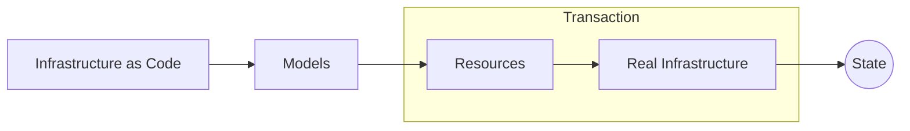
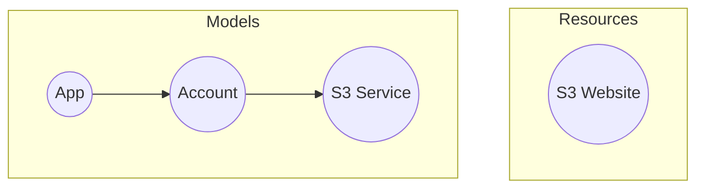

## Introduction
We introduced a classic ["hello world" example](/docs/getting-started/hello-world) in the getting started section.
But we did not get to explain it in great detail.<br/>
Now that you have understood the fundamentals, it is time to revisit the code and really understand "how" it all works.

## Transaction
When Octo translates resources to real infrastructure,
it uses a transaction to ensure that the state of the infrastructure is always consistent.
At the end of the transaction we also generate a State, which is used to track the state of the infrastructure,
including any failed resources.


## Libraries
The Octo ecosystem consists of many smaller sets of libraries -
each building a different functionality on top of each other.

In the hello-world example, you used below libraries.
- **octo**: This is the base library responsible for providing base model definitions,
transaction management, state management, diffs, serialization, and other common functions.
- **octo-aws-cdk**: This library provides a specific implementation of Octo for AWS.
It defines specific modules to build on the AWS infrastructure, such as a S3 bucket.
- **octo-event-listeners**: This library provides a few common listeners to listen and log Octo events,
and to generate beautiful HTML reports.

## Visualizing the Graph
The hello-world code produced one of the most basic infrastructure possible in AWS -
a S3 bucket that hosts static website files.

In Octo, this infrastructure can be visualized both from a model and resource perspective.


## Modules
The hello-world example uses three modules to set up the infrastructure.
* The first module, `SimpleAppModule`, defines the app node. This module, as the name suggests,
does not create any resources, and only exists to add the root node.
* The second module, `AwsIniAccountModule`, defines the account node. It also does not create any resources,
but instead loads AWS credentials from the INI files in your `~/.aws/` directory.
* The third module, `AwsS3StaticWebsiteServiceModule`, defines a service node. It creates a S3 bucket,
and uploads the static website files as pointed by the `websiteSourcePath` variable. 
```typescript title="module-definitions.ts"
this.add(SimpleAppModule, 'app-module', { name: 'aws-s3-website' });

this.add(AwsIniAccountModule, 'account-module', {
  accountId: config.AWS_ACCOUNT_ID,
  app: stub<App>('${{app-module.model.app}}'),
});

this.add(AwsS3StaticWebsiteServiceModule, 's3-website-service-module', {
  account: stub<Account>('${{account-module.model.account}}'),
  awsRegionId: 'us-east-1',
  bucketName: config.AWS_S3_WEBSITE_BUCKET_NAME,
  directoryPath: websiteSourcePath,
});
```

:::tip
As a user of these modules, you do not need to worry about how they create the infrastructure.
You can simply treat them as black box functions that promises to create the infrastructure in a certain way to
satisfy your desire of having a website hosted on S3.
:::

## Running the example
The hello-world example was ran by running the `main.ts` file.

To run an Octo app, you first need to initialize it using below code.
Here we initialized the main `Octo` class with the `LocalStateProvider` state provider,
which will store the state in a local file.<br/>
We also passed it the `EventLoggerListener` listener which provides logging support and HTML reports.
```typescript title="main.ts"
const octo = new Octo();
const stateProvider = new LocalStateProvider(octoStatePath);
await octo.initialize(stateProvider, [{ type: EventLoggerListener }]);
```

<br/>In the next step, we load the modules into the Octo class.<br />
We use the `ModuleDefinitions` class to fetch all the modules, and then order them as per the model hierarchy.
```typescript title="main.ts"
const moduleDefinitions = new ModuleDefinitions();
for (const moduleDefinition of moduleDefinitions.getAll()) {
  octo.loadModule(moduleDefinition.module, moduleDefinition.moduleId, moduleDefinition.moduleInputs);
}
octo.orderModules(moduleDefinitions.getAll().map((m) => m.module));
```

<br/>Finally, we call the `compose()` method to get all modules to run,
which would run the `onInit()` method of each module and generate the necessary models.<br/>
Knowing that `app` is our root node, we get this node, and pass it to the `beginTransaction()` method,
which would start to calculate diffs in each model node,
gather all resource nodes, compare all resource nodes with previous state, and generate diffs.<br/>
It would then run each affected resource's actions, and finally commit the transaction by updating the state.
```typescript title="main.ts"
const { 'app-module.model.app': app } = (await octo.compose()) as { 'app-module.model.app': App };
const transaction = octo.beginTransaction(app);
await transaction.next();
```

## HTML Reports
After running the hello-world example for the first time,
you would notice a new HTML report in your root directory.
You can load this report in your browser to see the generated infrastructure.
You will notice that all resources are generated for the first time.

As you make changes to your `module-definitions.ts` file, either to delete the S3 bucket,
or to change one of the static website files in the `website` directory,
you will notice the reports indicates the respective changes.

## State Files
Finally, let's focus on the autogenerated state files that represents the state of your infrastructure.

```
models.json
resources.json
<my-bucket-name>-manifest.json
```

The `models.json` and `resources.json` contains serialized output of Models, Resources and other Octo components.<br />
The `<my-bucket-name>-manifest.json` file is specific to the `AwsS3StaticWebsiteServiceModule` module
and contains all files of the website currently being tracked.

We implore you to open and inspect each of these files to better understand how Octo stores state!

## Summary
In this section we have dissected the hello-world example in great detail.
We have looked at the various modules and touched their inner workings.
We have also looked at transactions and state files.

Having grasped all fundamental concepts, hopefully now you have a better understanding of how Octo works!
In next sections, we will look even deeper into each component and generate custom ones for your specific needs!