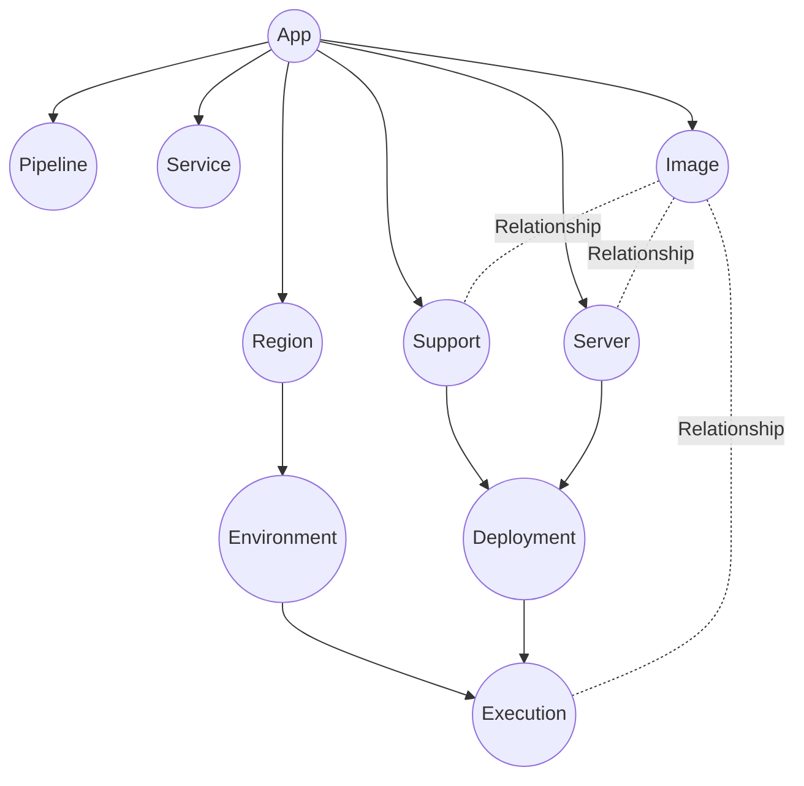
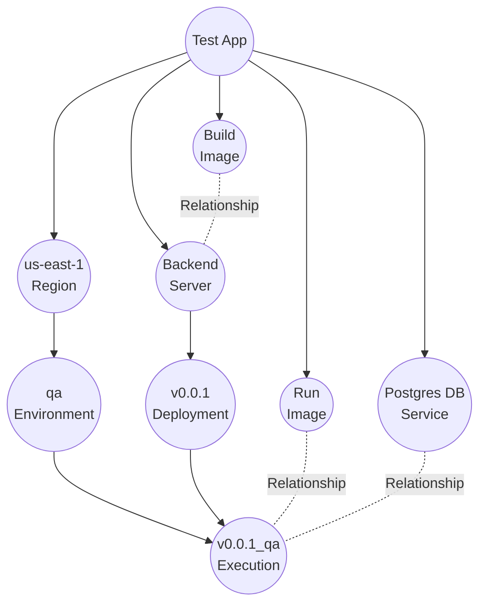

## Definition
A model serves as the fundamental building block in Octo, upon which all other concepts are built.

It's important to note that a developer's perception of infrastructure differs significantly from that of DevOps,
with the latter being much closer to lower level details, and thus more complex.
For this reason, it is the responsibility of DevOps to architect the CDK and maintain simplicity for developers.

Octo helps in that by allowing them to define Models - the primary units developers interact with.
These models represent and encapsulate infrastructure units from a developer's standpoint.

Models are designed to be simple and hierarchical, encapsulating lower-level infrastructure elements.
Below are the models currently supported.

### App
An app is the starting node of your project. It sits at the top of the model tree, with all other models linked to it.
It doesn't represent any underlying infrastructure; instead, it distinguishes one app from another.

### Region
A region represents the physical geographical area where the app can be deployed.
Typically, for redundancy and low latency, an app is deployed in multiple regions.
Therefore, it's common to have multiple region nodes under the app.

### Environment
An app follows a lifecycle, where new code progresses to production.
For instance, code is initially tested in pre-production environments like QA or Staging to catch bugs.
An environment node model represents this process.
From an infrastructure standpoint, an environment is a child of a region.
However, if both Region A and Region B have a QA Environment, from an application development perspective,
the QA environment can also be treated as one, deployed in two regions.

### Server
A server represents a logical microservice or server where you deploy your code, such as frontend, backend, or database.

### Support
A support is like a server but for infrastructure components.
They are not directly related to your application, but are required to support your application,
such as load balancers, or consul.

### Deployment
A deployment signifies the code being published at a specific point in time.
As you develop your application and commit new code, a new deployment node must be created to represent the updated code.
This essentially marks a new version of your server or support.

### Execution
An execution combines a Deployment and an Environment,
representing the operation of a physical server running deployment code in a specific environment.

### Service
A service represents third-party services that your application relies on.
While it may seem similar to a Support node, it differs because it doesn't support having a deployment.
Examples include managed AWS SQS or S3 bucket.

### Image
An image represents a Docker image utilized for building or running a Deployment.

### Pipeline
A pipeline represents a CI/CD pipeline capable of various automations,
including building and deploying code, running Octo commands, and more.

## Example
Here is a typical model for a simple backend server with a database might appear.

Here's what this example infrastructure represents,  
It's an app with a single region and a single environment.
It includes a single server with a single version deployed in the environment.
The server uses a build image for deployment and an execution image for running.
Additionally, there's a database service hosted elsewhere, which the execution utilizes to make database calls.

:::info[Was the visualization helpful?]
The purpose of graphs in Octo is to ensure that everything in this model is self-explanatory.
These core models serve as the fundamental building blocks of infrastructure,
enabling developers to comprehend and intuitively interact with them.
Developers can customize and visualize their own infrastructure to best suit their needs.
:::

## Summary

Here, we've covered the fundamentals of Models — the building blocks of infrastructure for developers.
However, we haven't delved into analyzing code or discussed how to write or modify your own models.
That will come later. For now, our focus is on learning the concepts.
