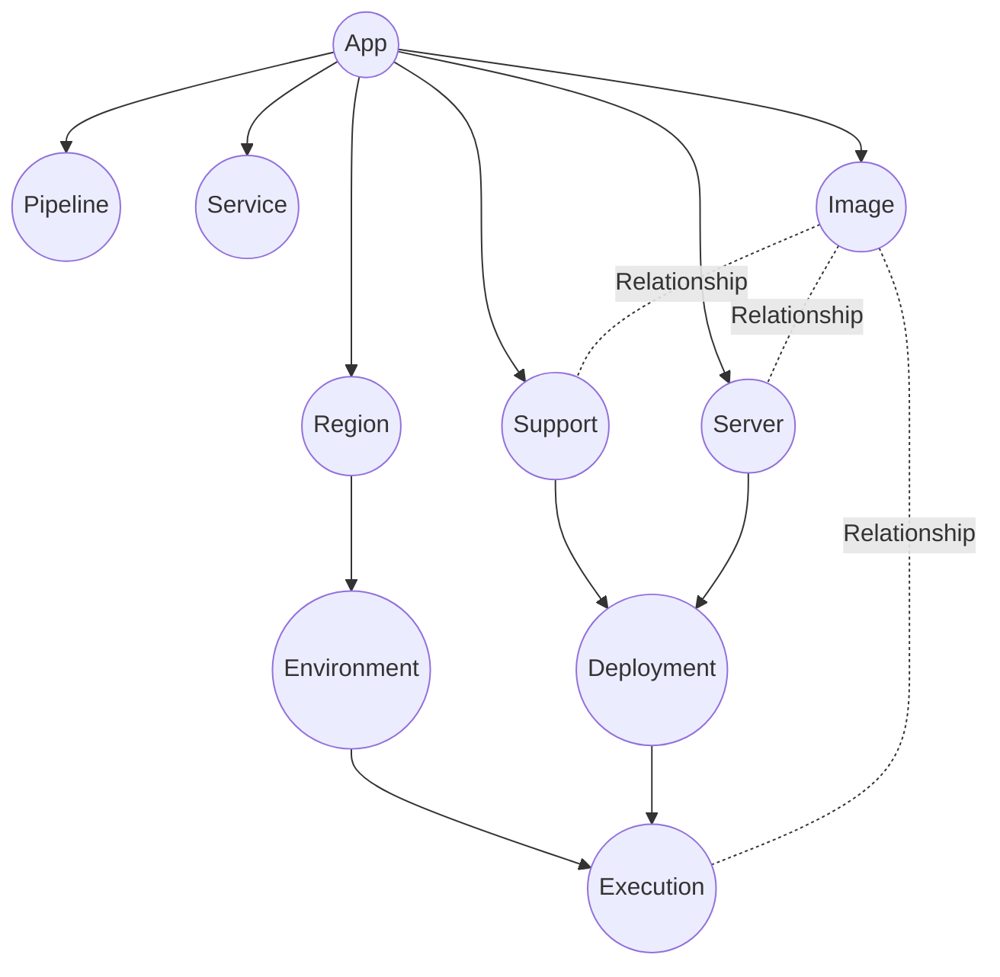

import { Brand } from '@site/src/components/brand';

## Definition
A model is the most basic unit in <Brand/> upon which all other concepts are built.
It represents a node that you birth into your infrastructure.
Below are the models that are currently supported.



### App
An app is a logical node model that represents the overall project you are trying to build.
It is the root of the model tree and all other models are children of it.

### Region
A region node model represents a physical location where your infrastructure is deployed.

### Environment
An environment node model represents a logical separation of your infrastructure, such as `qa`, `staging`, `prod`.

### Server
A server node model represents a logical microservice or a server that you deploy your code to,
such as `frontend`, `backend`, `database`.

### Support
A support node model is very similar to a Server, but is used to represent servers that are not directly related
to your application, but are required to support your application, such as `load balancers`, `consul`, etc.

### Deployment
A deployment node model represents Server/Support code that gets deployed and run.
As you build your application and commit new code, a new deployment node will need to be created
that will represent the updated code. This is effectively a new version of your Server/Support.

### Execution
An execution node model is a combination of a Deployment and an Environment that represents
running a physical server running deployment code in a specific environment.

### Service
A service node model represents 3rd party services that your application depends on.
This might sound similar to a Support node, but is different because it doesn't support having a deployment.
A managed AWS SQS, or a S3 bucket are examples of a Service.

### Image
An image node model represents a Docker image that is used to build/run a Deployment.

### Pipeline
A pipeline node model represents a CI/CD pipeline that can be used for various automations,
such as building and deploying code, running <Brand/> commands, etc.

## Anatomy of a Model
:::note
We use an opinionated naming convention to prepend the letter `A` to all abstract classes,
and the letter `I` to all interfaces. E.g. `AModel` is the abstract model, vs `IModel` is the interface to the model.
:::

:::tip
It is uncommon to define a new model, but extending them to add functionality is common.
:::

A model can be defined using the `@Model` decorator.
```typescript
@Model()
export class App extends AModel<IApp, App> {
  readonly MODEL_NAME: string = 'app';

  getContext(): string;

  synth(): IApp;

  static override async unSynth(app: IApp): Promise<App>;
}
```

There are quite a few things to unpack here, so let's break it down.

```typescript
@Model()
```
This is a decorator that tells <Brand/> that this class is a model.
This decorator allows the class to be registered to the `Model Serialization Service` that allows it to
serialize and deserialize the class using the `synth` and `unSynth` methods.

```typescript
class App extends AModel<IApp, App> {}
```
Every model must extend the `AModel` class. The abstract Model class is a generic class that accepts an
interface and the class itself as a generic type. The interface is used to define the shape of the model.
Notice, how the `synth()` and `unSynth()` methods use this shape to serialize and deserialize the model.

```typescript
readonly MODEL_NAME: string = 'app';
```
Every model must have a unique name. Now all nodes of `App` type will share this name.

```typescript
getContext(): string;
```
A context of a model is defined as a string that represents the path of the model in the model tree.
You can also think of it as a chain of parent represented in string.
<br/>E.g. an `App` is the root node, so its context is `app=<name>`.
<br/>Similarly, a `Region` has context of `region=<name>,app=<name>`.

```typescript
synth(): IApp;
static override async unSynth(app: IApp): Promise<App>;
```
These two methods are used to serialize and deserialize the model.
