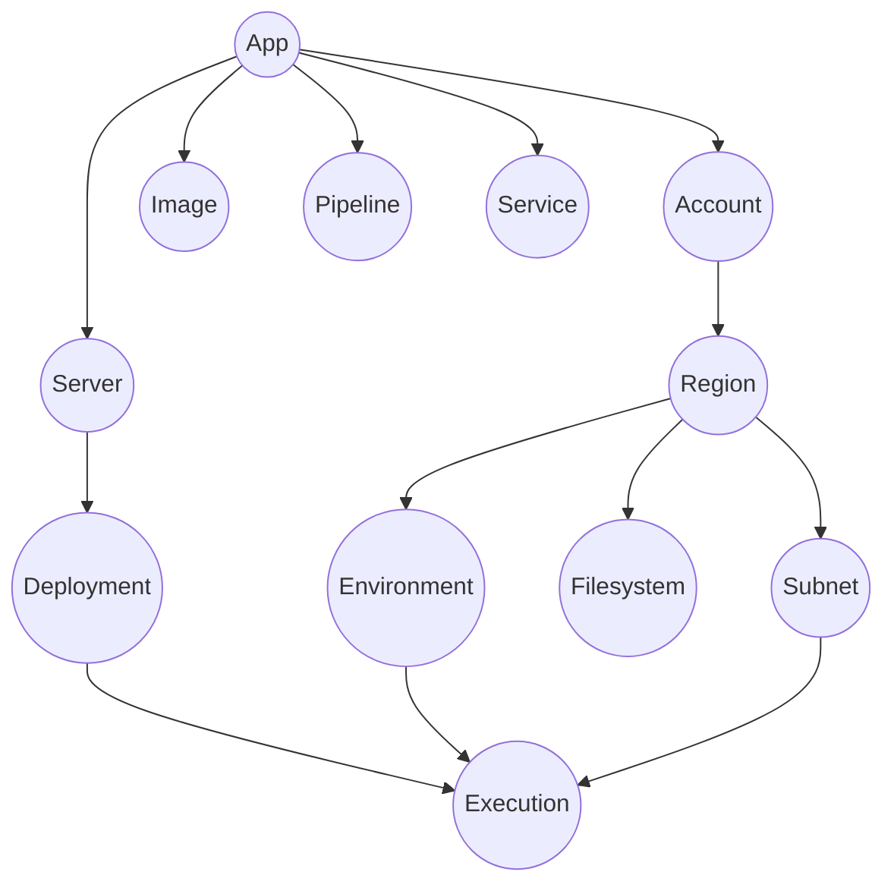
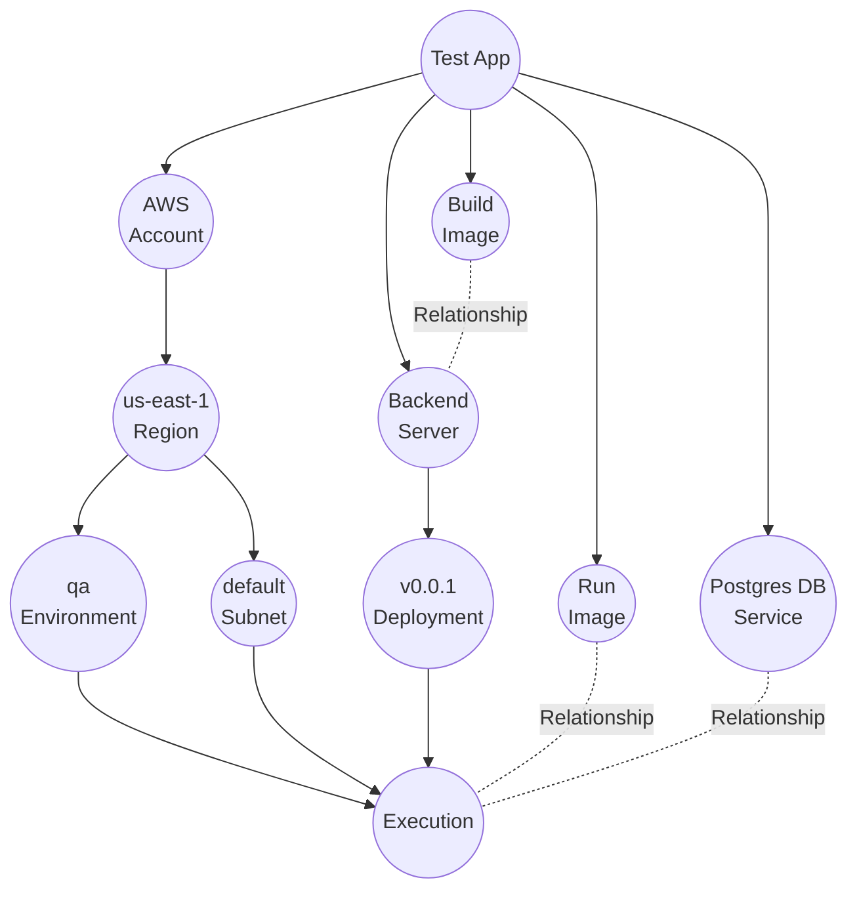

import Tabs from '@theme/Tabs';
import TabItem from '@theme/TabItem';

## Introduction
In Octo, models are the core building blocks on which all other concepts are built.

Since developers and DevOps engineers often view infrastructure very differently,
developers need a higher-level, object-oriented abstraction to work with.
Models provide this abstraction, encapsulating infrastructure in a way that feels natural to developers.

:::note
Models are designed to be simple and hierarchical, encapsulating lower-level infrastructure nodes.
:::

Each model is represented as a graph node, and Octo defines only a small, consistent set of these nodes.
With just these handful of nodes, any infrastructure can be expressed.
This shared vocabulary ensures that developers have a common, unified understanding of the system.

## Default Models
Octo provides a set of core models that act as the building blocks of infrastructure.
Each model is represented as a node in the graph, and together they define Octo's base hierarchy.

This hierarchy is shipped as the default, but it is designed to be extended.
When used with CDK libraries, developers can introduce new relationships or additional nodes,
allowing the hierarchy to evolve and better represent custom infrastructure patterns.

<Tabs>
  <TabItem value="App" label="App" default>
    An app is the starting node of your project, and is the root of the model tree.
    It is a logical grouping of infrastructure and services that together form an application.
    By definition, there can only be one app node per project.
  </TabItem>
  <TabItem value="Account" label="Account">
    An account represents a cloud account, e.g. an AWS account.
    Depending on your needs, the app node can have multiple accounts under it.
    Often, a multi-account setup is when you would like to separate environments,
    such as qa and prod in separate accounts.
  </TabItem>
  <TabItem value="Region" label="Region">
    A region, often also referred as a shard, or a zone,
    represents the physical geographical area from where your application will be serviced from.
    Typically for redundancy and low latency, an application is deployed in multiple regions.
    Therefore, it's common to have multiple region nodes under an account.
  </TabItem>
  <TabItem value="Environment" label="Environment">
    Every application goes through a lifecycle, where new code is promoted from development to production, 
    e.g. `QA -> Staging -> Prod`. An environment node model represents one such lifecycle stage.

    Conceptually, you might think of an environment as a single logical unit under your application,
    however from an infrastructure standpoint, that environment node must physically exist
    under every region it is part of. E.g. if you have a QA environment, and 2 regions serving that environment,
    you will add the QA node respectively under those 2 regions.
  </TabItem>
  <TabItem value="Filesystem" label="Filesystem">
    A filesystem node represents a mounted filesystem, such as an EFS mount in AWS.
    Because the filesystem node is child of a region node, filesystems are considered local mount filesystems,
    i.e. only executions within the same region can mount and access them.

    For a global filesystem, it is better to use a `Service` node, such as an AWS S3 bucket service node.
  </TabItem>
  <TabItem value="Subnet" label="Subnet">
    A Subnet is a logical subdivision within a region's network.
    For example, you might define public subnets (accessible from the internet)
    and private subnets (restricted to internal resources).
    Subnets are commonly used to isolate different parts of your infrastructure,
    controlling access through defined gateways and security rules.
  </TabItem>
  <TabItem value="Server" label="Server">
    A Server represents a logical microservice or codebase within your application.
    For example, if your application includes a frontend, a backend, a payment server, and a database access server,
    each of these codebases — whether organized in a monorepo or separate repositories,
    would map to a distinct Server node.

    The Server node is defined as a direct child of the App node.
    This allows you to declare your list of servers once at the application level,
    rather than repeating them for each account or region where they are deployed.
  </TabItem>
  <TabItem value="Deployment" label="Deployment">
    A Deployment represents the publishing of code at a specific point in time.
    Each time you wish to deploy an updated codebase,
    a new Deployment node is created to capture that version of the code.
    Conceptually, it signifies a new version of the corresponding Server.
  </TabItem>
  <TabItem value="Execution" label="Execution">
    An execution is the combination of a Deployment, an Environment, and a Subnet.
    It represents a physical server, running a specific deployment code,
    in a given environment, placed in the given subnet. 
    E.g. a QA deployment of the payments server running in a private subnet of Region A.

    An execution typically translates to an ECS task or an EKS pod running in AWS.
  </TabItem>
  <TabItem value="Service" label="Service">
    A Service represents a third-party or managed service that your application depends on.
    Unlike a Server, which you directly manage and deploy code to,
    Services are typically hosted and maintained by a provider.
    Examples include a managed Redis instance, an AWS RDS database, or a cloud-hosted Kafka queue.
  </TabItem>
  <TabItem value="Image" label="Image">
    An image represents a Docker/Containerized image utilized for building or running your microservices.
  </TabItem>
  <TabItem value="Pipeline" label="Pipeline">
    A pipeline represents a CI/CD pipeline capable of various automations, including building and deploying code.
    A pipeline typically would automate the process of testing and packaging a code change into an image,
    and then deploying the image into an execution.
  </TabItem>
</Tabs>

## Example
Here is how a typical model graph for a simple backend server with a database might appear.

- This is an app with a single region, a single environment, and a default subnet.
- It includes a single server with a single deployment.
- An execution for this deployment is placed in this environment and subnet.
- The server uses a build image to create the deployment and a run image to be used by the execution.
- Additionally, there's a database service hosted elsewhere, which the execution utilizes to make database calls.

:::info[Was this visualization helpful?]
The purpose of graphs in Octo is to ensure that everything in this model graph is self-explanatory.
These core models serve as the fundamental building blocks of infrastructure,
enabling developers to comprehend and intuitively interact with them.
:::

## Summary
We've covered Models - the building blocks that encapsulate the infrastructure for developers.
We covered the role of the `octo` library, individual model nodes, their relationships to other model nodes,
and how they can be stitched together to create a complex infrastructure.
