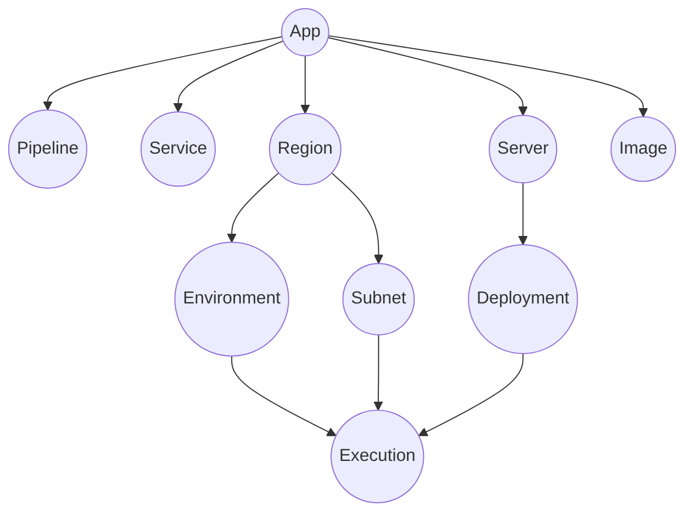
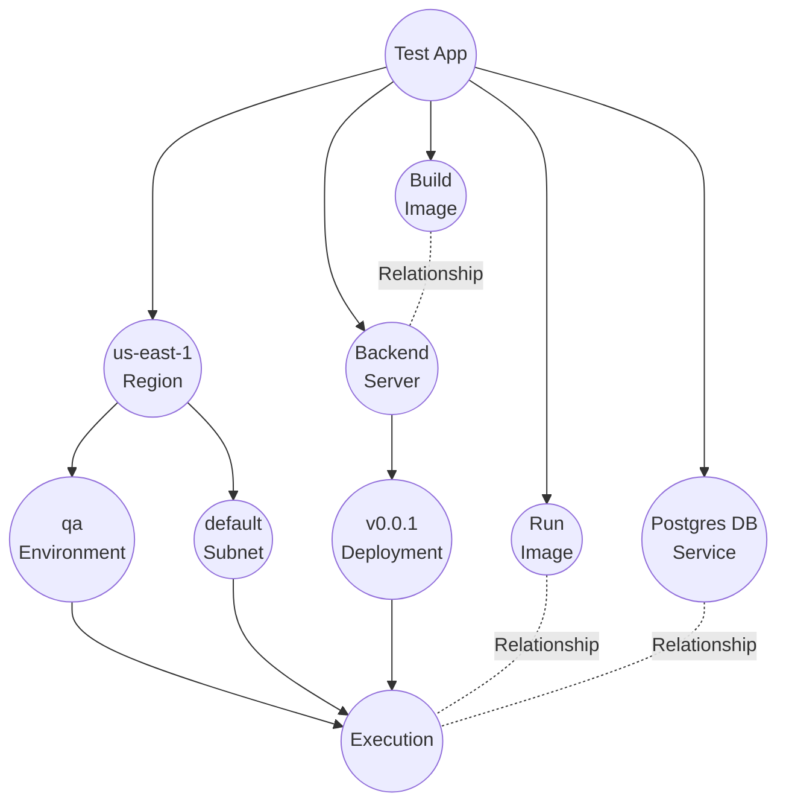

import Tabs from '@theme/Tabs';
import TabItem from '@theme/TabItem';

## Introduction
In Octo, the model serves as the fundamental building block upon which all other concepts build.

It's important to note that a developer's perception of infrastructure differs significantly from that of DevOps,
with the latter being much closer to the lower level details,
having more up-to-date, and in-depth knowledge of the infrastructure. 
This eligibility positions DevOps as the ideal team to architect the CDK and ensure simplicity for developers.
Octo facilitates this by enabling them to define **Models**, which are the primary units developers interact with.
These models effectively represent and encapsulate infrastructure from the developer's perspective.

:::note
Models are designed to be simple and hierarchical, encapsulating lower-level infrastructure elements.
:::

## Default Models
Octo supports below models.
These models are often extended to create custom encapsulations of your specific infrastructure needs.
One such implementation is provided in the next section. 
But between each implementation, the core concepts of these models do not change.

<Tabs>
  <TabItem value="App" label="App" default>
    An app is the starting node of your project.
    It sits at the top of the model tree, with all other models linked to it.
    It doesn't represent any underlying infrastructure; instead, it distinguishes one app from another.
  </TabItem>
  <TabItem value="Region" label="Region">
    A region represents the physical geographical area where the app can be deployed.
    Typically, for redundancy and low latency, an app is deployed in multiple regions.
    Therefore, it's common to have multiple region nodes under the app.
  </TabItem>
  <TabItem value="Subnet" label="Subnet">
    A subnet is a logical sub-division of the region, e.g. a public and a private subnet.
    A subnet is often used to isolate parts of your infrastructure with access gates in the front.
  </TabItem>
  <TabItem value="Environment" label="Environment">
    Every app follows a lifecycle, where new code progresses from development to production,
    e.g. QA, Staging, and Prod. An environment node model represents this process.
    From an infrastructure standpoint, an environment must be a child of a region.
    However conceptually, if both Region A and Region B have a QA Environment,
    the QA environment can also be treated as one unit, deployed in two regions.
  </TabItem>
  <TabItem value="Server" label="Server">
    A server represents a logical microservice or server where you deploy your code,
    such as frontend, backend, or database.
  </TabItem>
  <TabItem value="Deployment" label="Deployment">
    A deployment signifies the code being published at a specific point in time.
    As you develop your microservice and commit new code,
    a new deployment node must be created to represent the updated code.
    Conceptually, this represents a new version of your server.
  </TabItem>
  <TabItem value="Execution" label="Execution">
    An execution is the combination of a Deployment, an Environment, and a Subnet.
    It represents a physical server, running the deployment code, in the given environment, placed in the given subnet.
  </TabItem>
  <TabItem value="Service" label="Service">
    A service represents third-party services that your application relies on.
    What separates them from Server is that Services are hosted and managed outside.
    An external Redis server on the cloud, or a managed Kafka queue from AWS, are a few examples.
  </TabItem>
  <TabItem value="Image" label="Image">
    An image represents a Docker image utilized for building or running your microservices.
  </TabItem>
  <TabItem value="Pipeline" label="Pipeline">
    A pipeline represents a CI/CD pipeline capable of various automations,
    including building and deploying code, running Octo projects, and more.
  </TabItem>
</Tabs>

## Example
Here is how a typical model graph for a simple backend server with a database might appear.

This is an app with a single region, a single environment, and a default subnet.
It includes a single server with a single deployment.
An execution for this deployment is placed in this environment, in this subnet.
The server uses a build image to create the deployment and a run image to to be used by the execution.
Additionally, there's a database service hosted elsewhere, which the execution utilizes to make database calls.

:::info[Was the visualization helpful?]
The purpose of graphs in Octo is to ensure that everything in this model graph is self-explanatory.
These core models serve as the fundamental building blocks of infrastructure,
enabling developers to comprehend and intuitively interact with them.
:::

## Summary
We've covered Models - the building blocks that encapsulate the infrastructure for developers.
Next, we will look at some extensions of Models in AWS.
