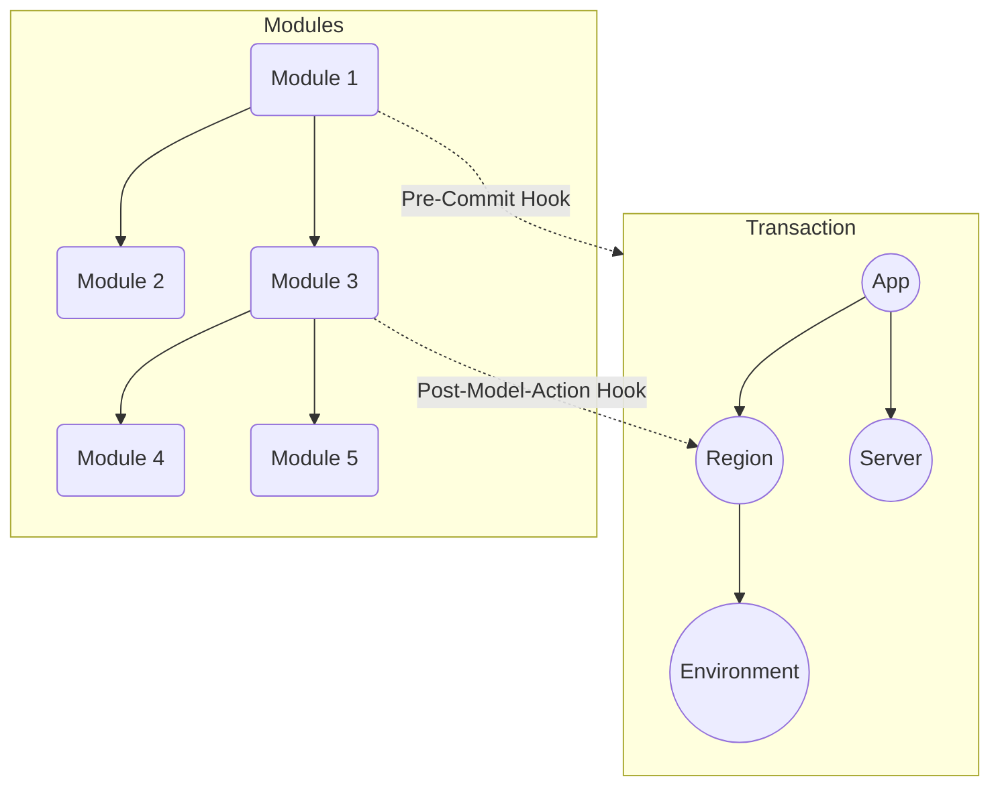

## Definition
A Module is a higher order function that enables manipulation of infrastructure to achieve "functionality"
using **Hooks**.

Within a transaction, multiple events are trigerred. Using modules and hooks, it is possible to react to these events
to enhance the infrastructure to do more than just adding models.

Let's take an example. Imagine you need to register all running instances to Consul,
and update nginx to refresh its configuration. This is called "Service Discovery".
You can either write code to create a new Consul service, a new nginx server, and configure it all.
But since you will likely need these services in every environment,
you will need to repeat this code for every environment you create.
 A better way is to write modules, using hooks to react on "environment create" event,
and add this code there once.

Modules follow hierarchy, which means you can import other modules.
And each module can have their own imports and hooks to register.
Registration and execution of these modules happens exactly as you might expect -
with imported modules being executed first.

In above diagram, hooks of *Module 2* are registered before *Module 1*.
Depending on which events they trigger on, their execution might be out of order,
but if both hooks trigger on the same event, then *Module 2* hooks would take precedence over *Module 1*
since the latter depends on the former.

:::tip
A module can be *shared*, i.e. you can import functionalities instead of writing your own. 
:::

## Hooks
Octo has predefined set of events that can happen during a transaction.
Hooks allows users to be able to register to such events.

### Pre Commit Hook
Allows users to listen when a transaction is about to be comitted. Such hooks can be used for cleanup purposes.

### Post Model Action Hook
Allows users to listen when a Model action has run. A model action is not to be confused with a Resource action,
where former is still manipulating Octo models, while latter is realizing those changes to the actual infrastructure.
These hooks can be used to add a functionality.

There are many predefined actions - details of which can be found later in this document,
or you can enable your custom actions with hooks.

