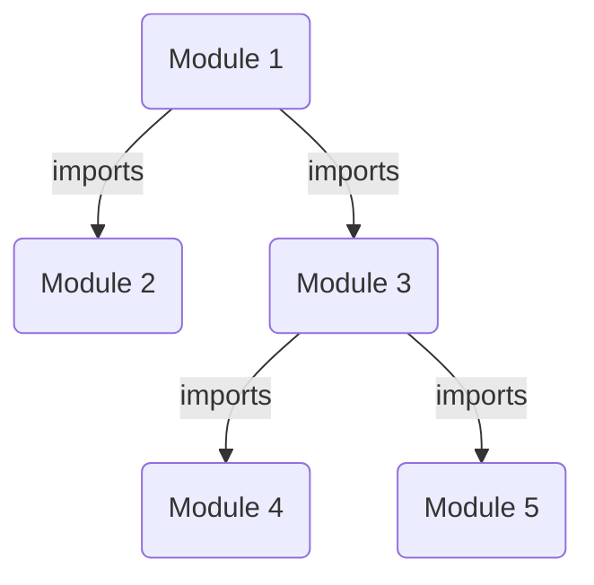
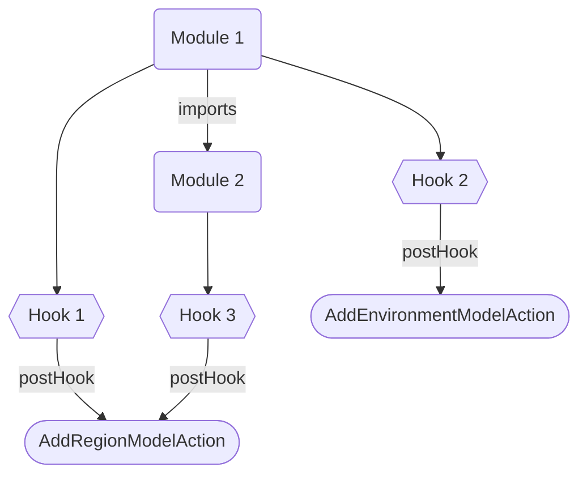

import Tabs from '@theme/Tabs';
import TabItem from '@theme/TabItem';

## Introduction
Module in Octo refers to a collection of Models come together to form a cohesive unit of higher order infrastructure.

:::info
Modules is how you define your IaC repository.
Within modules you mix models, which in turn generates resources, which generates infrastructure.
:::

:::tip
Modules are shareable, which is an incredibly powerful feature.
It supports isolated "infrastructure plugins" that you can simply import to enhance your infrastructure.
:::

## Example
Modules are classes annotated with a `@Module()` decorator, and implements the `IModule<T>` interface.

```typescript
@Module({
  imports: [RegionModule],
})
export class EnvironmentModule implements IModule<Environment> {
  constructor(private readonly region: Region) {}

  async onInit(): Promise<Environment> {
    const environment = new Environment('qa');
    this.region.addEnvironment(environment);
    return environment;
  }
}
```

In this example, we create an EnvironmentModule that imports the RegionModule.
It is not important for the EnvironmentModule to know how a region is created,
except that the RegionModule returns a `Region` which the EnvironmentModule is injected with.
The EnvironmentModule then manipulates models, and returns the model it promised to return.

## Module Imports



Modules supports hierarchy, which means you can import other modules,
which in turn can import more modules.
Registration and execution of these modules happens exactly as you might expect -
with imported modules being executed first.

## Hooks
Modules support hooks - a sequence of callbacks triggered before or after specific events.
You can register for these transaction events within the module to execute custom code.

<Tabs>
  <TabItem value="CommitHooks" label="Commit Hooks" default>
    Pre/Post Commit Hooks allows you to take an action before or after the entire transaction is committed.
  </TabItem>
  <TabItem value="ModelHooks" label="Model Hooks" default>
    Pre/Post Model Hooks allows you to take an action before or after a model action runs.
  </TabItem>
  <TabItem value="ResourceHooks" label="Resource Hooks" default>
    Pre/Post Resource Hooks allows you to take an action before or after a resource action runs.
  </TabItem>
</Tabs>

### Example

```typescript
@Module({
  postModelActionHooks: [
    {
      ACTION_NAME: 'AddRegionModelAction',
      handle: async (diff: Diff, actionInputs: ActionInputs, actionOutputs: ActionOutputs): Promise<ActionOutputs> => {
        // Manipulate some resources.

        // Return the final output.
        return actionOutputs;
      }
    }
  ]
})
export class EnvironmentModule implements IModule<Environment> {
  // ...
}
```

In this example, the EnvironmentModule is registering a hook into the "AddRegionModelAction" event.
It triggers after this action has run, and before the next action.

:::info
Hooks enhances/extends the functionality of Actions.
:::

### Order of Execution
Hooks are bound to Modules, and since modules have an hierarchy, hook registration follows that hierarchy.



In above diagram, hooks of "Module 2" are registered before "Module 1".<br />
The resulting order of execution post "AddRegionModelAction" event would be - `[Hook 3, Hook 1]`<br />
The resulting order of execution post "AddEnvironmentModelAction" event would be - `[Hook 2]`

## Summary
We discussed Modules and Hooks.
Modules unify models into cohesive infrastructure units.
It supports hierarchical imports and customizable hooks for enhanced transactional control.
