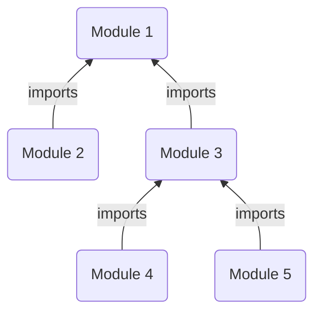

## Introduction
In Octo, modules act as a packaging unit for models, overlays, resources, anchors, and actions.
When packaged, modules becomes a single unit capable of generating and managing a section of infrastructure
in a very precise and opinionated manner.

:::tip
Modules are shareable, which is an incredibly powerful feature.
These are "infrastructure plugins" that you can simply import to implement a piece of infrastructure,
or swap one with another compatible module.
:::

Having the ability to define and share modules comes with several benefits,
* **Reduces Duplication**: Defining modules for yourself or the community allows you to
reuse them across several projects.
* **Standardization & Compliance**: Modules can be defined to fulfill certain standards,
such as HIPAA, PCI, ISO, GDPR, etc. Reusing the same modules can then result in same standards across all projects.
* **Security**: Modules can be defined to enforce security policies, such as encryption, access control, etc.

## Modules are opinionated
One of the key distinctions between Octo and other IaC tools or CDKs is in how infrastructure is expressed.
Traditional tools expose developers directly to raw infrastructure resources,
leaving it entirely up to them to decide how to assemble those resources and with what parameters.

Modules, in contrast, are pre-packaged collections of infrastructure resources,
defined in a precise and opinionated way.<br/>
The degree of flexibility a module offers depends entirely on its implementor —
some may allow extensive customization, while others enforce stricter defaults.

:::info
Instead of viewing this as a limitation, consider how would you share a pre-built AWS infrastructure setup.
To make it reusable, you inevitably need to make assumptions and design choices on the user's behalf.
Those assumptions then define the boundaries or limitations of what can be customized.

Octo addresses this by keeping modules small and isolated,
reducing the impact of those limitations and making them easier to compose or swap.
:::

:::tip
If a pre-build module does not meet your needs, you can always create a custom module.
It's easier than you think!

Octo's own pre-build modules are open for contribution and suggestions.
We are also open to enhance or add modules to fit community needs.
:::

## Importing other modules
Often modules require access to other module's models, overlays, resources, and/or anchors.
But modules can't directly import other modules, otherwise it would create a vicious dependency trap.

Instead, modules expresses their dependencies on other modules using "indirect inputs" and anchors,
and relies on users running the modules to pass correct values.

Here's an example of a module's schema input.
This module is defining an environment to set up an AWS ECS cluster within a region.
Since it needs access to a region in AWS, it imposes an indirect dependency on the users to pass
a Region model which exposes a matching anchor `AwsRegionAnchorSchema`.
```typescript
export class AwsEcsEnvironmentModuleSchema {
  @Validate([
    {
      options: {
        isModel: { anchors: [{ schema: AwsRegionAnchorSchema }], NODE_NAME: 'region' },
      },
    },
    {
      destruct: (value: AwsEcsEnvironmentModuleSchema['region']): [RegionSchema] => [value.synth()],
      options: {
        isSchema: { schema: RegionSchema },
      },
    },
  ])
  region = Schema<Region>();
}
```
And this is how users might pass a Region model from a different module,
```typescript
{
  region: stub<Region>('${{region-module.model.region}}'),
}
```
Here the user is passing a relevant Region model from the `region-module` module that satisfies the above constraints.

:::tip
So far, we haven't explained any of the code snippets, which might make them feel a bit overwhelming at first glance.
That's okay — the goal here is to introduce the core idea of importing other modules.

As you progress through the documentation, we'll gradually break down these snippets step by step,
so they'll start to feel familiar and intuitive.
:::

## Module Hierarchy
Modules don't just package any number of Octo components. They are precise, and often focused on a single model.
And since models are hierarchical in nature, modules must be applied in a set pattern that conforms to the hierarchy.

E.g. an AppModule must execute before an AccountModule, which must execute before a RegionModule, and so on.
This is also necessary when importing other modules, as you cannot import a module which hasn't executed yet!

In Octo, modules are ordered for execution using the `orderModules()` method.
```typescript
octo.orderModules([AppModule, AccountModule, RegionModule, ...]);
```

Combining module hierarchy with input-based imports, you can even visualize modules as a graph.


## Summary
In this section we have discussed Modules.
Modules unify models and resources into cohesive infrastructure units.
It supports hierarchical imports, allowing modules to inter-depend on each other, and boost modularity and reusability.
