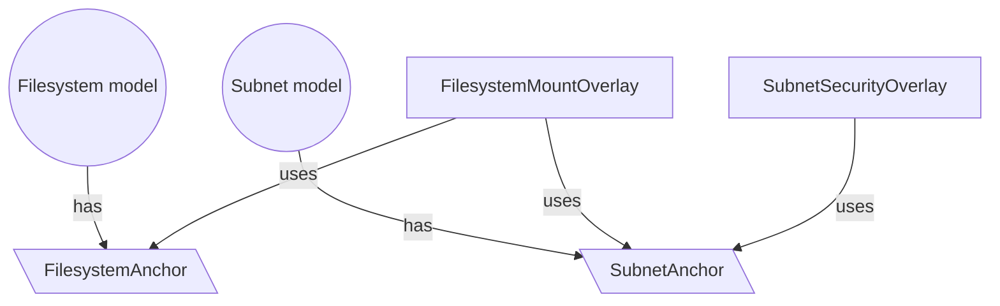

## Definition
An overlay is a special kind of model to represent infrastructure components that span across multiple models.
You should think of an overlay as an infrastructure functionality that exists as a crossover between one or more models.

:::info
Just like resources, the base generic `octo` library does not define any base overlays.
Overlays are defined in an implementation of the `octo` library for a specific cloud provider
to achieve functionality that models cannot provide by themselves.
:::

Take a Filesystem in AWS as an example.
The filesystem model can aptly represent an EFS filesystem in a Region.
But in order to be used by a server, it must be mounted to a Subnet.<br/>
Where should the functionality of adding a filesystem mount be defined?
Neither the Filesystem, nor the Subnet model can define this without adding a lot of unnecessary complexity to them.

Overlays exists to solve this problem.
In this scenario, a new overlay can be created which takes both the Filesystem and Subnet models as inputs,
and then encapsulates the logic of adding a filesystem mount to a server.

:::tip
An overlay can also be created on a single model.
Typically, you would do this to add additional functionalities to a model other than its base functionality.
:::

:::info[TL;DR:]
An overlay enriches models by adding additional capabilities.
Think of overlays as additional functionalities that can be easily added or removed from models.
This flexibility enables model implementations to remain clean and free of unnecessary clutter.
:::

## Overlay-Anchor Relationship
Overlays don't really take models as inputs, for the reasons mentioned in [Anchors](/docs/fundamentals/anchors).
Instead, overlays takes *Anchors* as inputs.

In this diagram, we have an overlay between *Model 1* and *Model 2*,
and another overlay just on *Model 2*,
using anchors present in both models.



:::info
An overlay is not fundamentally different from a Model, but rather an extension of it.
Like them, it also has its own actions, can be serialized and deserialized,
and is managed by Octo using the same state files.

Just like a model, and overlay is also considered an internal implementation.
Overlays can also expose their own anchors as its representative.
:::

## End-to-End Example

The following walkthrough shows the full lifecycle of an overlay:
**define it → implement `diffAnchors()` → use it in a module**.

### Step 1 — Define the overlay

An overlay extends `AOverlay` and is decorated with `@Overlay`.
It accepts anchors (not models) in its constructor.

```typescript title="filesystem-mount.overlay.ts"
@Overlay('@my-cdk', 'filesystem-mount', FilesystemMountOverlaySchema)
export class FilesystemMountOverlay
  extends AOverlay<FilesystemMountOverlaySchema, FilesystemMountOverlay>
{
  constructor(
    overlayId: string,
    properties: FilesystemMountOverlaySchema['properties'],
    anchors: [FilesystemAnchor, SubnetAnchor],
  ) {
    super(overlayId, properties, anchors);
  }
}
```

```typescript title="filesystem-mount.overlay.schema.ts"
export class FilesystemMountOverlaySchema extends BaseOverlaySchema {
  override properties = Schema<{
    mountPath: string;
  }>();
}
```

### Step 2 — Implement `diffAnchors()` (optional override)

The base `diffAnchors()` emits an `ADD` diff for each anchor on every run.
Override it when you need richer diff semantics — for example, to detect that a
mount path property has changed and emit an `UPDATE` diff instead.

```typescript title="filesystem-mount.overlay.ts"
override async diffAnchors(): Promise<Diff[]> {
  const diffs: Diff[] = [];

  for (const anchor of this.getAnchors()) {
    diffs.push(new Diff(this, DiffAction.ADD, 'anchor', anchor));
  }

  // Emit a property UPDATE diff so that update actions fire when mountPath changes.
  // (previous state is compared by the transaction engine using the persisted schema)
  diffs.push(new Diff(this, DiffAction.UPDATE, 'properties', { mountPath: this.properties.mountPath }));

  return diffs;
}
```

### Step 3 — Create and register the overlay in a module

Inside a module's `onInit()`, retrieve the anchors from the relevant models and
construct the overlay. The overlay is returned alongside the primary model so
Octo tracks it in the model graph.

```typescript title="filesystem-mount.module.ts"
@Module('@my-cdk', FilesystemMountModuleSchema)
export class FilesystemMountModule
  extends AModule<FilesystemMountModuleSchema, FilesystemMountOverlay>
{
  async onInit(inputs: FilesystemMountModuleSchema): Promise<UnknownModel[]> {
    // Retrieve anchors from previously composed modules.
    const [filesystemAnchor] = inputs.filesystem.getAnchors([], [FilesystemAnchor]);
    const [subnetAnchor] = inputs.subnet.getAnchors([], [SubnetAnchor]);

    // Create the overlay — it automatically registers graph dependencies
    // on both anchor parent models.
    const overlay = new FilesystemMountOverlay(
      `filesystem-mount-${inputs.filesystem.filesystemId}-${inputs.subnet.subnetId}`,
      { mountPath: inputs.mountPath },
      [filesystemAnchor as FilesystemAnchor, subnetAnchor as SubnetAnchor],
    );

    return [overlay];
  }
}
```

:::info
See the [`@Overlay` decorator API reference](/api/octo/function/Overlay) and
the [`AOverlay` class reference](/api/octo/class/AOverlay) for full API details.
:::

## Summary
In this section we discussed Overlays, and its relationship to Models and Anchors.
We discussed how these add-on classes aid in maintaining complex infrastructure functionalities,
and helps keep models pure and simplified.
