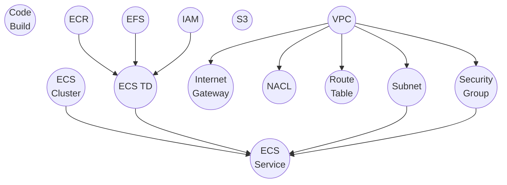
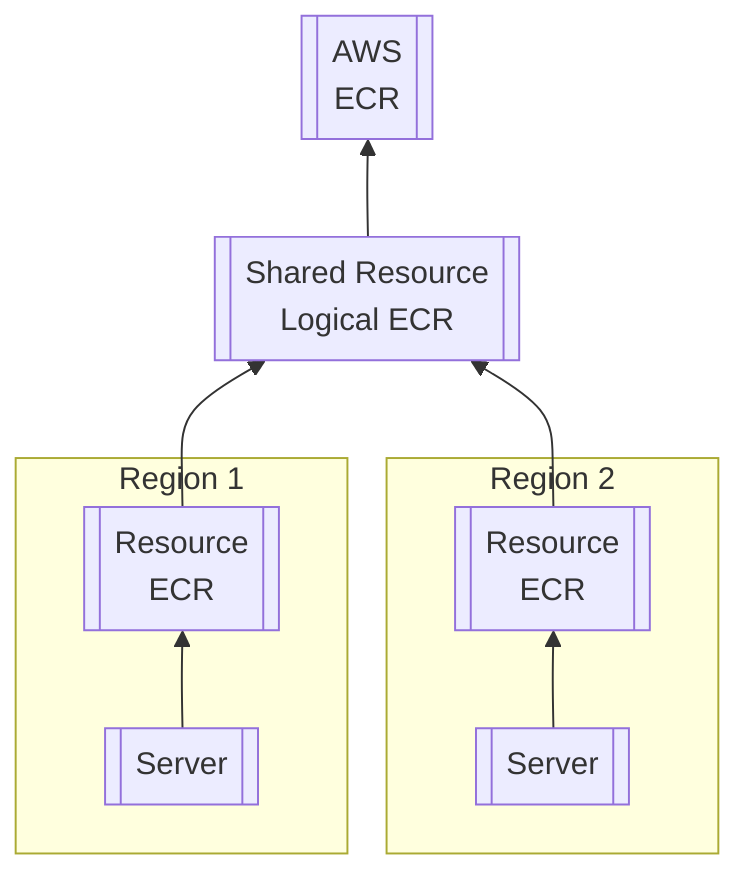

## Definition
A resource is a sub-component of a Model. Its implementation varies based on the cloud provider being used.
It is a fundamental building block of the infrastructure specific to that provider.

Similar to models for developers, resources cater mainly to DevOps,
who have a deeper understanding of the lower-level details of the cloud provider.

Like models, resources are designed to be simple and hierarchical.
They encapsulate context from models and capture lower-level details of infrastructure.

## Resources in octo-aws-cdk
:::note
The `octo` library serves as the foundational library that defines the modeling of CDKs,
whereas the `octo-aws-cdk` library is our implementation of Octo tailored for the AWS cloud provider.
:::

Here, we present our implementation for AWS as a cloud provider from our `octo-aws-cdk` library.

:::info[Doesn't make sense?]
No worries! Its a partial internal representation of how some resources in `octo-aws-cdk` are interconnected.

The concept we aim to convey here is its similarity to and distinction from models.

Each node in models can output one or more of these resources.
The precise relationship between a model and its resources is architected by DevOps.
:::

## Shared Resource
A shared resource is an extension of a resource.
It behaves as a resource in all respects except that it doesn't represent any physical infrastructure component.
Instead, it signifies the sharing of this resource across Octo's defined boundary.

In Octo, your infrastructure can be partitioned into boundaries,
ensuring that operations in one part do not affect the other.
More often than not, the boundary is the region.

In `octo-aws-cdk`, a region is defined within the subnet.
Since, in AWS, a region can have many subnets, Octo can have many regions within a single AWS region.
For instance, us-east-1 with 6 subnets can define 6 separate Octo regions, each distinct from the others.
This capability enables more granular resource division.

However, for certain resources, duplicating data doesn't make sense.
For example, ECR doesn't need to store the same image twice in us-east-1
just because there are 2 Octo regions within the same AWS region.
This is where shared resources come into play.
A shared resource enables you to maintain separate logical copies of resources
that point to the same underlying infrastructure.

## Summary
Here, we've explored Resources - the building blocks of cloud provider infrastructure - for DevOps.
Much more about Resources will be covered in later sections.
