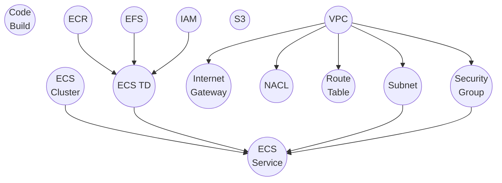
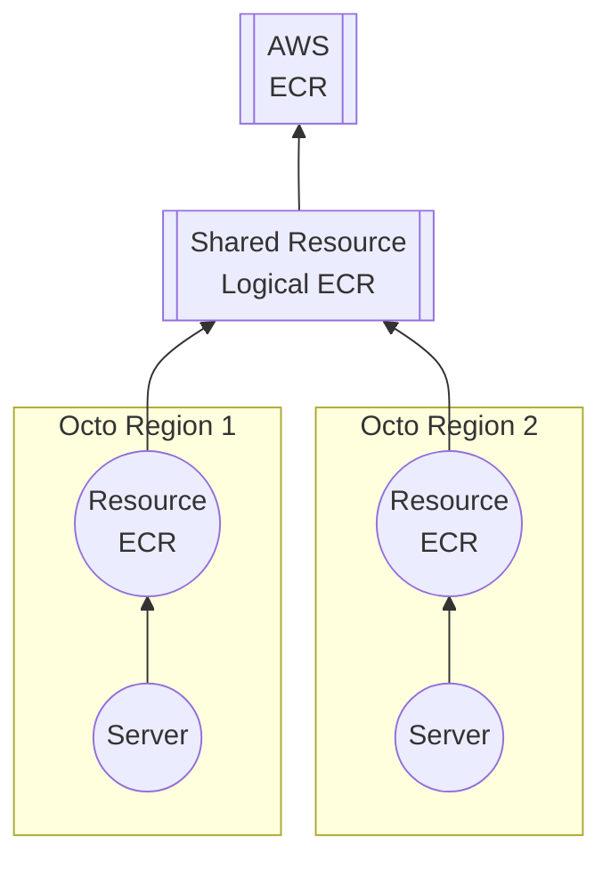

## Introduction
In Octo, a resource represents the true underlying infrastructure.
It is the decay of Models into individual infrastructure components.

:::note
The base generic `octo` library does not expose any resources.
All resource definitions are from the `octo-*-cdk` libraries,
such as `octo-aws-cdk` resource definitions exposed below.
:::

Like models, resources are designed to be simple and hierarchical.
They encapsulate context from models and capture lower-level details of infrastructure.

## Resources in octo-aws-cdk
This is a partial internal representation of how some resources in `octo-aws-cdk` are interconnected.

Each node in models can output one or more of these resources.
The precise relationship between a model and its resources is what makes up the model's definition.

## Shared Resources
A shared resource is an extension of a resource.
It behaves as a resource in all aspects except that it doesn't represent any physical infrastructure component.
Instead, it signifies the sharing of this resource across Octo's defined boundaries.

In Octo, your infrastructure can be partitioned into boundaries,
ensuring that operations in one part do not affect the other.
More often than not, the boundary is a Region. 
In `octo-aws-cdk`, a region is equivalent to an [Availability Zone](https://docs.aws.amazon.com/whitepapers/latest/aws-fault-isolation-boundaries/availability-zones.html).
For instance, AWS_US_EAST_1A AWS_US_EAST_1B are Octo regions in AWS us-east-1 region in AZ A and B respectively.

For certain resources, duplicating data does not make sense.
For example, ECR doesn't need to store the same image twice in us-east-1
just because there are 2 Octo regions within the same AWS region.
This is where shared resources come into play.
A shared resource enables you to maintain separate logical copies of resources
that point to the same underlying infrastructure.

## Summary
We discussed the concepts behind Resources and Shared-Resources, and how they associate with Models.
But we haven't covered the internals of Resources, or how to make one.
Those details will be covered gradually in later sections.
For now, think of Resources simply as black boxes representing your infrastructure components.
