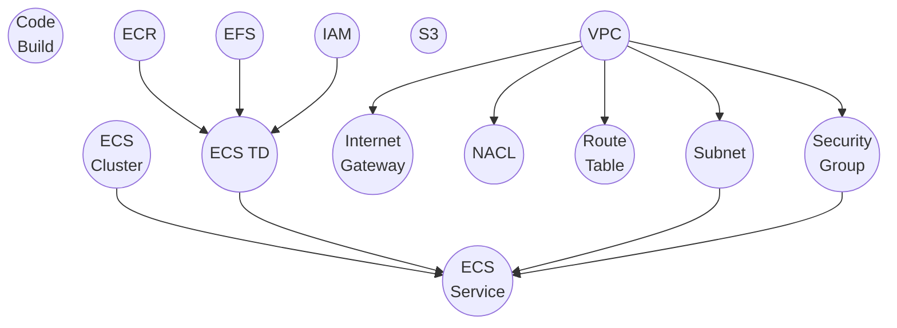
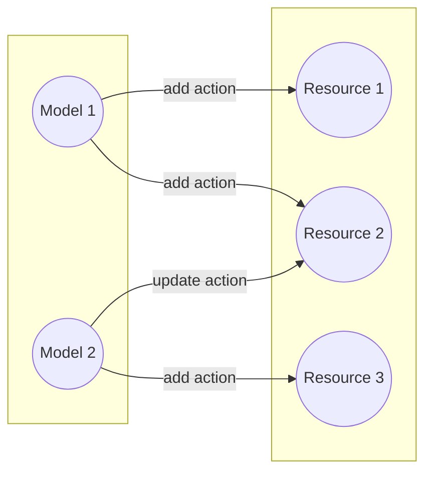
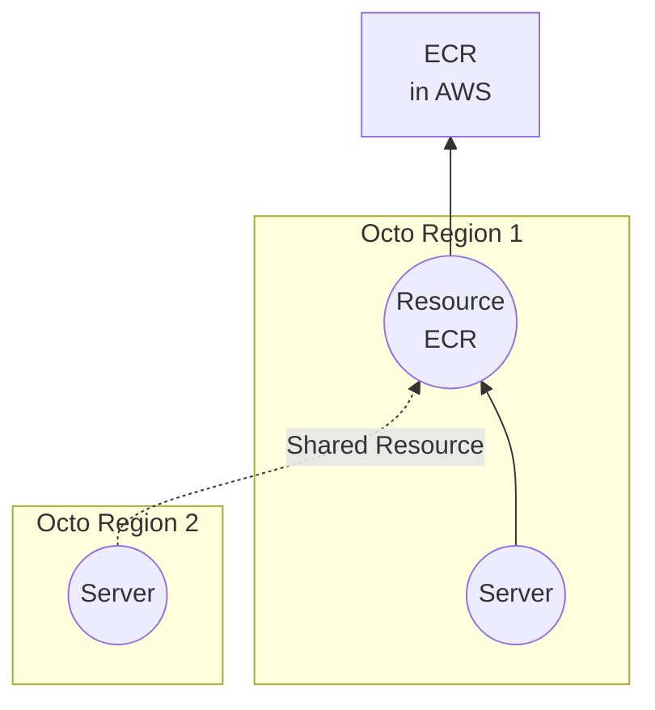

## Introduction
In Octo, a resource represents a true underlying infrastructure component.
It is the decay of Models into individual infrastructure components.

:::note
The base generic `octo` library does not expose any resources. It only defines the base models and their relationships.
Resources come from an implementation of the `octo` library for a specific cloud provider,
such as `octo-aws-cdk` for AWS. A few of octo-aws-cdk's exposed resources are shown below.
:::

Like models, resources are designed to be simple and hierarchical.
They inherit context from models and capture the lower-level details of an infrastructure component.

## Resources in octo-aws-cdk
Below is a partial internal representation of how some of the resources in `octo-aws-cdk` are interconnected.

This is just an example though. The real implementation exists in the library, with many more resources,
and many more relationships, which is not feasible to show here.
The intention here is to show how resources look like, and how they might be connected to each other.

Each model nodes previously discussed, can output one or more of such resources.
The precise relationship between a model and its resources is what makes up the model's definition and its actions.

## Model-Resource Relationship
Infrastructure-as-Code (IaC) tools exist to provision and manage infrastructure resources.
Traditional IaC tools expose developers directly to low-level resources,
for example, defining a VPC, an Internet Gateway, and subnets individually.

Octo instead, as you already know, uses Models for encapsulation, which abstracts these raw resources.
For instance, instead of setting up individual networking resources, you think of a Region model.

A Model defines a logical grouping of infrastructure and governs its lifecycle.
It uses `Actions` to create, update, replace, and delete these resources.
The diagram below illustrates how models produce resources through actions.

Once you understand a model's definition and its respective actions,
it becomes easier to think in terms of models, rather than individual resources.

:::info[So how does models know which resources to manipulate?]
The definition of resources and the relationship between a model and a resource is set by whoever writes the models.

`octo-aws-cdk`, for example, is an implementation of the `octo` library for AWS.
In this CDK implementation, we defined individual resources and chose which models manipulates what resources.
If you choose to use our AWS implementation, you will receive resources configured based on our standards.

You can also choose to write your own implementation, choose different resources,
and set completely different relationships all together.

**TL;DR;** Resources are subjective, defined by the implementor.
:::

## Shared Resources
In Octo, since models are graphs, they naturally form branches or boundaries,
ensuring that operations in one boundary do not affect the other.
More often than not, the boundary is a Region. 

When these models are translated into resources, from an infrastructure perspective,
some resources may be shared between boundaries.

For example in AWS, an ECR resource node (a repository for storing Docker images) doesn't need to be created for every Region.
Instead, the same ECR resource node will be shared across all Regions,
and images will be replicated internally by AWS. 
This is an implementation detail, determined by the implementor on which resources to share.
End users most likely don't need to worry about this, however, it is a good concept to understand.

:::info[TL;DR;]
A shared resource is a logical way of re-thinking the same resource in different boundaries.
:::

## Summary
We covered Resources and Shared-Resources -
which is the final encapsulation layer before the actual infrastructure is created.
We discussed how each resource node can be connected to other resource nodes,
and how they are associated with Models.
We also revisited how models create resources, and resources create infrastructure using Actions.
