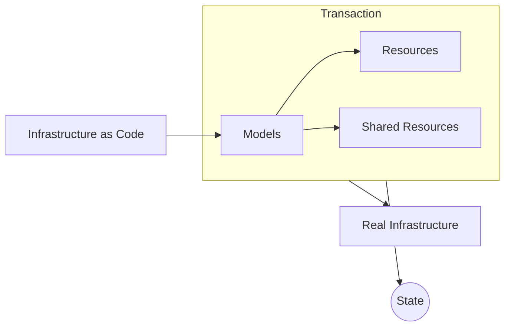

## Introduction
Unlike some CDKs and IaC tools, Octo operates on an abstracted layer of infrastructure.
The code you write is to manipulate the models which is then translated to individual Resources and Shared-Resources.
It is these Resources that represent the real infrastructure,
and Octo is responsible for translating them into the real infrastructure.

This transformation is done in a transaction, so that the state of the infrastructure is always consistent,
and developers have the opportunity to rollback changes if something goes wrong.
At the end of the transaction we also generate a State, which is used to track the state of the infrastructure.

## Libraries
As stated earlier, the Octo ecosystem consists of 2 sets of libraries - octo and octo-*-cdk.
The `octo` library is responsible for providing model definitions,
transaction management, state management, diffs, serialization, and other common functions.
In contrast, `octo-*-cdk` provides definitions
for Models, the individual Resources and Shared-Resources, and their respective Actions.

In other words, the `octo-*-cdk` library enhances the
`octo` library to fit individual cloud providers, such as AWS, Azure, and GCP.
We currently only support AWS, with future support to come for Azure, GCP, and other cloud providers.
