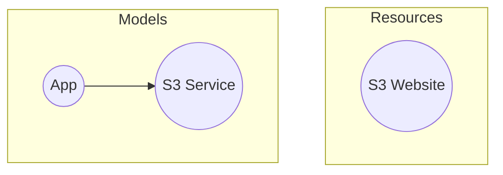

## Introduction
All previously discussed concepts should provide a solid foundation to explore some code examples.
<br /> We'll now revisit the [Hello World](/docs/getting-started/hello-world.mdx) guide
and offer a much-needed explanation of the code you ran earlier.

That code produced one of the most basic infrastructure possible in AWS - a S3 bucket that hosts static website files.
The model and resource graphs are below.


## Code Dissection
Let's revisit relevant parts of the code, but with more explanation.

```typescript title="app.module.ts"
@Module({
  imports: [S3WebsiteSaveManifestModule],
})
export class AppModule implements IModule<App> {
  async onInit(): Promise<App> {
    // ...
  }
}
```
We begin with a [Module](/docs/fundamentals/modules.mdx).
The AppModule imports the pre-defined `S3WebsiteSaveManifestModule` which is provided in the octo-aws-cdk library.
That module is responsible for generating a S3 manifest to track all the files uploaded to the website.<br />
Every module must implement `IModule<T>` where T is the return type.
You can return anything, including void.<br />
The `onInit()` method is where the module logic is implemented.
<br />

```typescript title="app.module.ts"
async onInit(): Promise<App> {
  const app = new App('octo-test');

  const service = new S3StaticWebsiteService(RegionId.AWS_US_EAST_1A, BUCKET_NAME);
  app.addService(service);

  await service.addSource(websiteSourcePath);

  return app;
}
```
Within the `onInit()` method we create an app, a `S3StaticWebsiteService` service,
and point it to the website directory where our static files live.
<br />

```typescript title="main.ts"
const octo = new Octo();
await octo.initialize(new LocalStateProvider(octoStatePath));
```
The `main.ts` file is where the project is bootstrapped.
The Octo class is initialized by passing a `StateProvider`.
We are using the `LocalStateProvider` which will store the state in a local file.
<br />

```typescript title="main.ts"
await octo.compose();
const app = (await octo.getModuleOutput<App>(AppModule)) as App;
```
Next, we call the `compose()` method to get all modules to run.
In this function, Octo runs the `onInit()` method of each registered and imported modules.<br />
The `getModuleOutput()` is a helper method to collect the output from any Module.
<br />

```typescript title="main.ts"
const generator = await octo.beginTransaction(app);
const modelTransactionResult = await generator.next();
await octo.commitTransaction(app, modelTransactionResult.value);
```
In this last part of the code, we use the `app` instance to begin the transaction,
which in turn traverses the app children, and generates diffs to work on.
A [generator](https://developer.mozilla.org/en-US/docs/Web/JavaScript/Reference/Global_Objects/Generator)
is returned.<br />
Upon calling `next()`, all diffs are processed in order,
the S3 bucket is created, and all website files are uploaded.<br />
The output of the generator is passed to `commitTransaction()` which will
update the state with the new models and resources.
<br />

:::tip
The **beginTransaction(app, options)** method returns a generator,
and accepts 4 options to stop the generator at important milestones to debug the application.
- **yieldModelDiffs** to output all the differences Octo found in the new model state vs the previous model state.
- **yieldModelTransaction** to output Octo's model execution plan order.
- **yieldResourceDiffs** to output all the differences Octo found in the new resource state vs the previous resource state.
- **yieldResourceTransaction** to output Octo's resource execution plan order.
:::

## State Files
Now let's focus on the autogenerated files that represents the state of your infrastructure.

```
models.json
resources.json
<my-bucket-name>-manifest.json
```

The `models.json` and `resources.json` contains serialized output of Models, Resources, and Shared Resources.<br />
The `<my-bucket-name>-manifest.json` file is specific to the S3StaticWebsiteService service
and contains all files of the website currently being tracked.

We implore you to open and inspect each of these files to better understand how Octo stores state!
