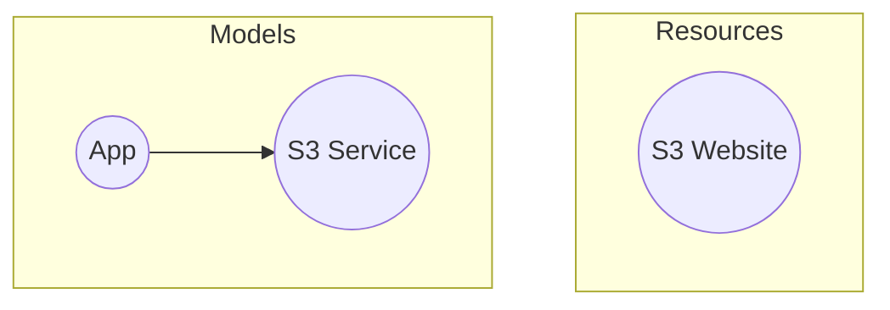

## Introduction
Above concepts should provide a solid foundation for diving into some code.
<br /> We'll now revisit the [Getting Started](/docs/getting-started.mdx) guide
and offer a much-needed explanation of the code you ran earlier.


That code produces one of the basic infrastructure possible in AWS - a S3 bucket that hosts static website files.
The model and resource graphs are below.


## Code Dissection
Let's revisit relevant parts of the code, but with more explanation.

```typescript
const octo = new OctoAws();
await octo.initialize(new LocalStateProvider(__dirname));
```
The first step is to instantiate the `octo-aws-cdk` library,
and then to initialize it by passing a `StateProvider`.
We are using the `LocalStateProvider` which will store the state in a local file.
<br />

```typescript
const app = new App('test');
const service = new S3StaticWebsiteService(RegionId.AWS_US_EAST_1A, BUCKET_NAME);
app.addService(service);
```
Next, we create an `App` and add a `Service` to it.
Notice, we are using the `S3StaticWebsiteService` which is provided by the `octo-aws-cdk` library,
since that service is specific to AWS.
<br />

```typescript
const diffs1 = await octoAws.diff(app);
const generator1 = await octoAws.beginTransaction(diffs1);
```
Next, we call the in-built `diff()` method which generates the difference in infrastructure between an earlier state
and the current state. Since, we don't have a previous state, the diff would reflect adding a new S3 website.
We encourage you to stop your debugger here and inspect the `diffs` variable.
<br /> The `diffs` are then passed to the `beginTransaction()` method which returns a
[generator](https://developer.mozilla.org/en-US/docs/Web/JavaScript/Reference/Global_Objects/Generator).
The generator can be configured to stop at each step so that we can extract information out of it.
<br />

```typescript
const modelTransactionResult1 = await generator1.next();
```
Next, we call the `next()` method on the generator to finish its work.
By this step, all `Actions` have run, and all new AWS resources are created.
<br />

```typescript
await octoAws.commitTransaction(app, modelTransactionResult1.value);
```
As a final step, we call the `commitTransaction()` method which will update the state with the new models and resources.
We now have an empty website!
<br />

```typescript
await service.addSource(`${websiteSourcePath}/error.html`);
await service.addSource(`${websiteSourcePath}/index.html`);

const diffs2 = await octoAws.diff(app);
const generator2 = await octoAws.beginTransaction(diffs2);

const modelTransactionResult2 = await generator2.next();
await octoAws.commitTransaction(app, modelTransactionResult2.value);
```
We then add files to the website using the built-in methods of `S3StaticWebsiteService`.
The same `diff()` and `transaction` routines ensures all files are uploaded to S3,
and are accessible via the website.

## Code Outputs
Now let's focus on the autogenerated files that represents the state of your infrastructure.
```
models.json
resources.json
shared-resources.json
<my-bucket-name>-manifest.json
```

The `models`, `resources`, and `shared-resources`, files are standard,
and contains serialized output of Models, Resources, and Shared Resources respectively.

The `bucket manifest` file is specific to the `S3StaticWebsiteService` service
and contains all files of the website currently being tracked.

We implore you to open and inspect each of these files to better understand how Octo works!
