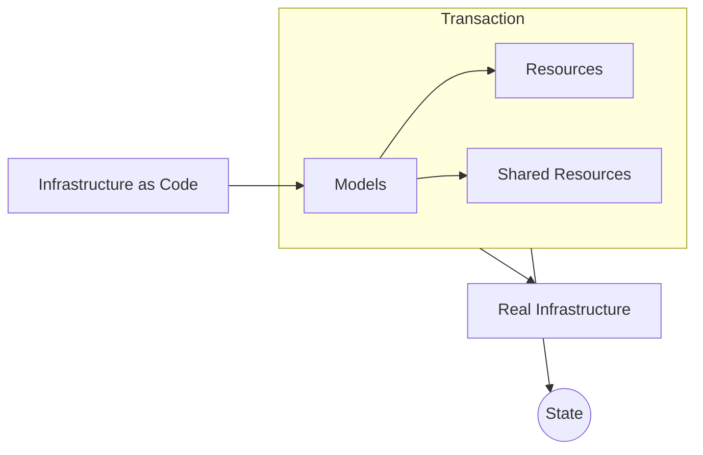

import { Brand } from '@site/src/components/brand';

## Definition
Unlike other CDKs and IaC tools, <Brand/> operates on an abstracted layer of infrastructure.
The code you write is to manipulate the models which is then translated to individual Resources and Shared-Resources.
It is these Resources that represent the real infrastructure,
and <Brand/> is responsible for translating them into the real infrastructure.

This transformation is done in a transaction, so that the state of the infrastructure is always consistent,
and users have the opportunity to rollback changes if something goes wrong.
At the end of the transaction we also generate a State, which is used to track the state of the infrastructure.

## Libraries
The <Brand/> ecosystem consists of 2 sets of libraries - <Brand/> and <Brand variation="proj-all-cdk" />.
The <Brand codify format="lower" /> library is responsible for providing model definitions,
transaction management, state management, diffs, serialization, and other common functions.
In contrast, <Brand codify format="lower" variation="proj-all-cdk" /> provides definitions
for the individual Resources and Shared-Resources, and their respective Actions.

In summary, the <Brand codify format="lower" variation="proj-all-cdk" /> library enhances the
<Brand codify format="lower" /> library to fit individual cloud providers, such as AWS, Azure, and GCP.
We currently support only AWS, with future support to come for Azure, GCP, and other cloud providers.