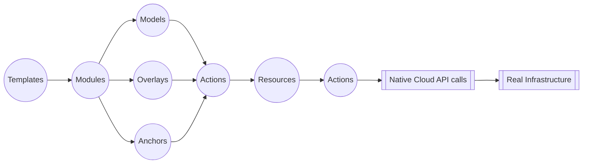
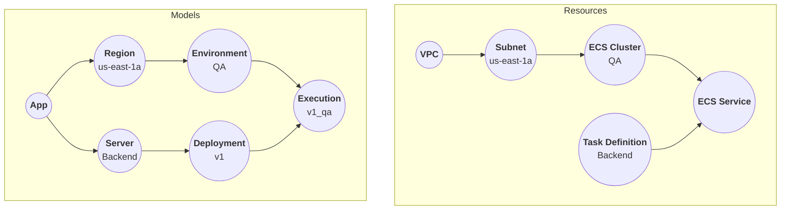

**Octo is a cloud-agnostic, general purpose, cloud infrastructure modeling and management tool.**<br /><br />
This simply means Octo can help you design, implement, and maintain infrastructure for your application
in the cloud of your choice (e.g. AWS or GCP), using concepts relevant to your application
rather than directly manipulating cloud resources.

So, let's get started! But before all that,
**Hello, and welcome to Octo ❤️**<br />

## What is Octo?
Octo project is a collection of libraries to help write cloud infrastructure as code.
These libraries are TypeScript based.

The base Octo library, called `octo`, is general-purpose, and it abstracts your infrastructure into logical components,
such as Models, Resources, and Modules. It is cloud-agnostic, meaning, the definition of Octo components
can work with any cloud provider.<br />
Then, there are individual libraries for supported cloud providers which takes the abstracted Octo components and
maps them to the underlying cloud resources.
One such library is `octo-aws-cdk`, which provides support for infrastructure in AWS.

:::info
While Octo has the capability to support multiple Cloud Providers,
today it only provides limited support for AWS.
As our community grows, we expect to write CDKs for other providers as well, such as GCP and Azure.
:::

## Why choose Octo?
You might already be familiar with one or more of the already available,
industry standard Infrastructure as Code (IaC) tools.

While these are amazing (really, they are!), they often get overly complicated, especially for new developers,
or for development teams where infrastructure work is managed by a dedicated devops team.
The knowledge gap on each low-level resource is unavoidable as your team and infrastructure grows.

Octo is different from its peers and is built from the ground up.<br/>
While other IaC tools interface with cloud resources directly,
Octo introduces the concept of **Models** - a set of higher order encapsulation of cloud resources that are
easy and more natural for developers to understand.

With Octo, infrastructure becomes more accessible to developers - easier to conceptualize, logical updates,
and more in-line with object-oriented programming.

## Quick Demo
:::note
Some examples and code in this video are outdated, but the concepts are still relevant.
The documentation in this website however, will always be up-to-date.
:::

<iframe
  allow="accelerometer; autoplay; clipboard-write; encrypted-media; gyroscope; picture-in-picture; web-share"
  allowfullscreen={"true"}
  frameborder="0"
  height="315"
  referrerpolicy="strict-origin-when-cross-origin"
  src="https://www.youtube.com/embed/Wn_3cou6x4o?si=AanE6ebctsv1NIMI?cc_load_policy=1&cc_lang_pref=en"
  title="Introduction - Octo Tutorials"
  width="560"
/>

## Overview
Octo is a tool for modeling cloud infrastructure.
It encapsulates the underlying infrastructure into components such as Modules, Models, and Resources.

Here is how it works - Modules are IaC packages for a specific cloud provider to do a specific infrastructure task.
You import or write new modules, which generates models,
which in turn creates infrastructure resources.
These resources then map to the real underlying infrastructure.
Each layer is translated into the next using Actions.<br/>
The final translation of resources to real infrastructure is done via Cloud APIs and SDKs.

Templates are community driven pre-built and tested examples of a collection of modules showcasing different
infrastructure use-cases. These help you get started with Octo quickly and easily.



This setup cleanly divides responsibilities between devops and developers.
Devops defines the building blocks that represents the infrastructure.
They define models, resources, and the translation actions.<br/>
Developers write templates and modules, and shape the infrastructure to self-serve their needs
using a common understanding of these components.

## Pseudo Example
Here's a pseudo Octo code (not a real code) of a **"Backend server running in QA environment"** in AWS infrastructure.
It demonstrates how you can think of your infrastructure from your application's perspective,
rather than individual resources of cloud.

```typescript
const app = new App('my-app');

const region = new AwsRegion(AwsRegionId.AWS_US_EAST_1A);
app.addRegion(region);

const environment = new AwsEnvironment('QA');
region.addEnvironment(environment);

const server = new AwsServer('Backend');
app.addServer(server);

const deployment = new AwsDeployment('v1');
server.addDeployment(deployment);

new AwsExecution(deployment, environment);
```

* `App`, `Environment`, `Execution`, etc. are all Models.
* Developers declare their infrastructure represented by the Model graph (below).
* Models are transformed into Resources, which logically represent the AWS infrastructure (below).
* Resources are transformed to AWS infrastructure using native AWS APIs.



## Benefits
**Power of Models**<br/>
Octo excels as a general-purpose cloud infrastructure modeling tool,
making modeling its greatest strength. By facilitating devops in creating clear and intuitive CDKs,
developers can logically write and test infrastructure changes.

**Abstraction for Developers**<br/>
Developers are shielded from intricate low-level infrastructure details,
interacting solely with higher constructs.

**Modules**<br/>
Octo introduces the concept of Modules - shareable and reusable infrastructure abstractions of
cloud resources to do one unit of work.

E.g. a module to set up networking VPC and subnets and expose this
encapsulation as a Region model. When you import this module, you automatically get the same setup
without having to write any code for it.

**Templates**<br/>
With help of community driven, pre-tested templates, it is possible to write the entire infrastructure
as one big reusable collection of modules.
You can customize and bootstrap your infrastructure setup in a matter of minutes.

Many templates already exists to support common use cases, ranging from static websites hosted in S3,
to complex Backend setup with load balancers, ECS containers, and Databases.

**TypeScript Advantage**<br/>
Being written in TypeScript, Octo inherits the benefits of TS,
including testing frameworks and the familiarity of one of the most widely used languages.

**Graph Representation**<br/>
Octo depicts infrastructure as a Graph,
enabling visualization of infrastructure as a well-defined set of nodes and edges.

Looking your entire infrastructure at a glance has never been simpler!
Dive deep into each model, or uncover how individual resources depend on each other.

Truly - a picture is worth a thousand words.

**Detailed Understanding of Changes**<br/>
Any alterations to the infrastructure graph are differentially analyzed
at both Model and Resource levels, offering developers both simplified and detailed insights into the proposed changes.

**Non Blocking Pipelines**<br/>
Being a graph, Octo understands the hierarchy and dependencies of resources.
Failure in one node won't block changes to other non-dependent nodes.

Octo also comes pre-bundled with necessary command line options to build a Continuous Delivery (CD) pipeline.
Create your own or pay for a more intuitive Pipeline in Octo UI.
Either way, you get a pipeline to apply Octo changes incrementally
to your infrastructure without heavy user intervention - just create a PR and watch your changes apply in minutes.

**In-Built Testing**<br/>
Octo provides a testing framework that can help your write meaningful, intuitive, test cases
for your infrastructure.
Don't retest providers and cloud resources. Make tests more meaningful with what your application needs.

**Recovery from Failures**<br/>
Octo saves the state of resources after every run and keeps track of
infrastructure changes. Execution is stopped at failures, and upon re-run, it will pick up from the same point.

**Beautiful HTML Reports**<br/>
After each run, Octo generates a beautiful HTML report that
shows the changes made to the infrastructure.

**End-to-End Solution**<br/>
Octo doesn't just provide solution to a slice of infrastructure problems,
but is rather a more complete framework and a one-stop shop for all your infrastructure needs.
Create complex infrastructure, set up pipeline, set up CICD, generate reports, apply security, view logs,
and many more features coming soon.

**& more**<br/>
Including manual capturing of infrastructure changes done outside Octo, Events, and so much more.
