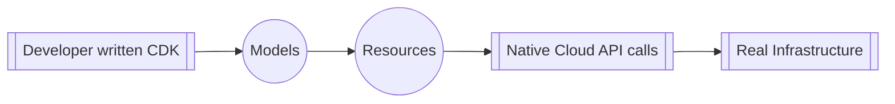
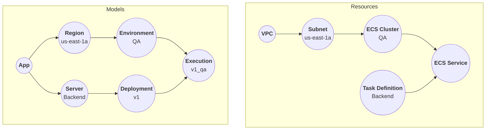

import { Link } from '@site/src/components/links';

Octo is a general-purpose cloud infrastructure modeling tool.

Today, managing cloud infrastructure is complex,
leading most companies to rely on dedicated devops engineers for smooth operation.

In recent times, the concept of Infrastructure as Code (IaC) has emerged,
leading to the development of CDKs - libraries specifically designed for writing IaC.
This shift has altered the responsibilities of devops,
with developers now expected to utilize CDKs to self-serve their infrastructure needs,
while devops continue to manage lower-level infrastructure details and base CDK libraries.

Existing CDKs are primarily tailored for devops, posing challenges for developers.
Their development background often doesn't align seamlessly with Infrastructure as Code (IaC).
Here's why:
- Developers are tasked with understanding numerous low-level infrastructure details,
yet staying abreast of base CDK development can be challenging, resulting in knowledge gaps.
- DevOps frequently update base CDKs, leading to the adoption of new code without comprehensive context.
- This process often entails learning a new language or tech stack, adding to the complexity.

Octo aims to bridge the gap between devops and developers by offering familiar constructs understood by both groups.
These constructs are implemented as classes in TypeScript, catering specifically to JavaScript/TypeScript developers.

## Overview
Octo is a tool for modeling cloud infrastructure.
It helps devops make base CDKs with easy-to-use features, called <Link id="model" />.
These features then turn into devops-friendly ones, called <Link id="resource" />,
and are used to build real infrastructure with Cloud APIs.



This setup cleanly divides responsibilities between devops and developers.
Devops create Models for developers to interact with the infrastructure.
Octo converts these Models into Resources,
which devops understand well and are better at representing the cloud infrastructure.
Then, Resources utilize Cloud APIs to manage the actual infrastructure.

## Example
Here's a simplified code of a **"Backend server running in QA environment"** in AWS infrastructure.

:::note
By a "rough" representation we mean we've intentionally simplified the details for clarity.
:::

```typescript
const app = new App('my-app');

const region = new AwsRegion(AwsRegionId.AWS_US_EAST_1A);
app.addRegion(region);

const environment = new Environment('QA');
region.addEnvironment(environment);

const server = new Server('Backend');
app.addServer(server);

const deployment = new Deployment('v1');
server.addDeployment(deployment);

new Execution(deployment, environment);
```

* `App`, `Environment`, `Execution`, etc are all Models.
* Developers interact with Models which is represented by the Model graph (below).
* Models are transformed to Resources which logically represents the AWS infrastructure (below).
* Resources are transformed to AWS infrastructure using native AWS APIs.



## Benefits
* **Modeling Power**: Octo excels as a general-purpose cloud infrastructure modeling tool,
making modeling its greatest strength. By facilitating devops in creating clear and intuitive CDKs,
developers can logically write and test infrastructure changes.
* **Abstraction for Developers**: Developers are shielded from intricate low-level infrastructure details,
interacting solely with Models.
* **TypeScript Advantage**: Being written in TypeScript, Octo inherits the benefits of TS,
including testing frameworks and the familiarity of one of the most widely used languages.
* **Graph Representation**: Octo depicts infrastructure as a Graph,
enabling visualization of infrastructure as a well-defined set of nodes and edges.
* **Detailed Understanding of Changes**: Any alterations to the infrastructure graph are differentially analyzed
at both Model and Resource levels, offering developers both simplified and detailed insights into the proposed changes.
* **Transactional Support**: Octo provides Transactions, allowing unit changes to the infrastructure graph,
with the capability to revert to a previous state in the event of errors.
