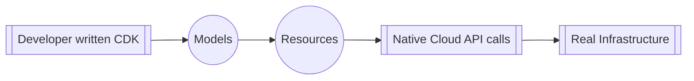
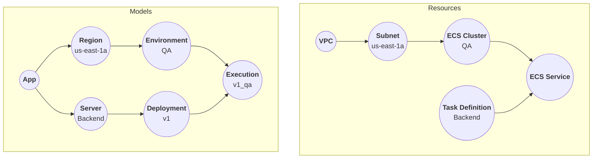

import { Brand } from '@site/src/components/brand';
import { Link } from '@site/src/components/links';

<Brand/> is a general-purpose cloud infrastructure modeling tool.
Today's cloud infrastructure is complicated at best,
with most companies employing dedicated devops engineers to take on the task
of managing all cloud infrastructure and to ensure its smooth operation.

In recent times, a new concept of having IaC (Infrastructure as Code) has come into play,
which has given birth to CDKs - libraries designed to write IaC.
This has blurred the lines, or at best limited the responsibility boundary for devops.
While devops still maintain the lower-level infrastructure details and base CDK libraries,
developers are now expected to know and self-serve their infrastructure needs by writing IaC using the base CDKs.

The problem with existing CDKs is that they are designed for devops.
For a developer, their development background doesn't align well with IaC;
- Developers are expected to know a lot of low-level infrastructure details,
but it is also not possible to actively track base CDK development, leading to gaps in knowledge.
- DevOps frequently change base CDKs. This often leads to mindless adoption of new code without much context.
- It often means learning a new language/tech stack.

<Brand/>'s purpose is to help bridge the gap between devops and developers
by providing common constructs that are well understood by both parties.
These constructs are classes written in TypeScript, making it ideal for JS/TS developers.

## Overview
<Brand/> is a general-purpose cloud infrastructure modeling tool to help devops generate base CDKs
that expose easy-to-use and developer-friendly constructs - <Link id="model" />,
which are then converted to devops-friendly constructs - <Link id="resource" />,
and from there real infrastructure components are built using native Cloud APIs.



This architecture exposes a clear separation of responsibilities for devops and developers.
Devops are responsible for exposing <Link id="model" /> that developer can use to manipulate the infrastructure.
<Brand/> then transforms the Models into <Link id="resource" /> that are much better understood by devops,
and are much better at expressing the cloud infrastructure.
From here on Resources then calls Cloud APIs to manipulate the real infrastructure.

## Example
Here is a rough representation of a **"Backend server running in QA environment"** in AWS infrastructure.

:::note
By a "rough" representation we mean to declare that we have intentionally hidden a few details in Models and Resources
to keep the example easy to understand.
:::

```typescript
const app = new App('my-app');

const region = new AwsRegion(AwsRegionId.AWS_US_EAST_1A);
app.addRegion(region);

const environment = new Environment('QA');
region.addEnvironment(environment);

const server = new Server('Backend');
app.addServer(server);

const deployment = new Deployment('v1');
server.addDeployment(deployment);

new Execution(deployment, environment);
```

* Developers interact with <Link id="model" /> which is represented by the Model graph (below).
* Models are transformed to <Link id="resource" /> which logically represents the AWS infrastructure (below).
* Resources are transformed to AWS infrastructure using native AWS APIs.



## Benefits
* <Brand/> is a general-purpose cloud infrastructure modeling tool, and hence its greatest strength is *Modeling*.
By helping devops expose clean and intuitive CDKs, developers can write and test infrastructure changes more logically.
* Developers are shielded from low-level infrastructure details,
since they only see and interact with <Link id="model" />.
* <Brand/> is written in TypeScript, thus bringing all the goodness of TS, testing frameworks,
and the familiarity of using one of the most widely used languages.
* <Brand/> represents the infrastructure as a Graph, which makes it possible to visualize the infrastructure
as a well defined set of nodes and edges.
* Any changes to the infrastructure graph are diffed at both *Model* and *Resource* levels,
giving developers both - a simplified and a detailed understanding of the changes they are proposing.
* <Brand/> exposes *Transactions* i.e. unit changes to infrastructure graph, with the ability to rollback
to a previous state in case of errors.
