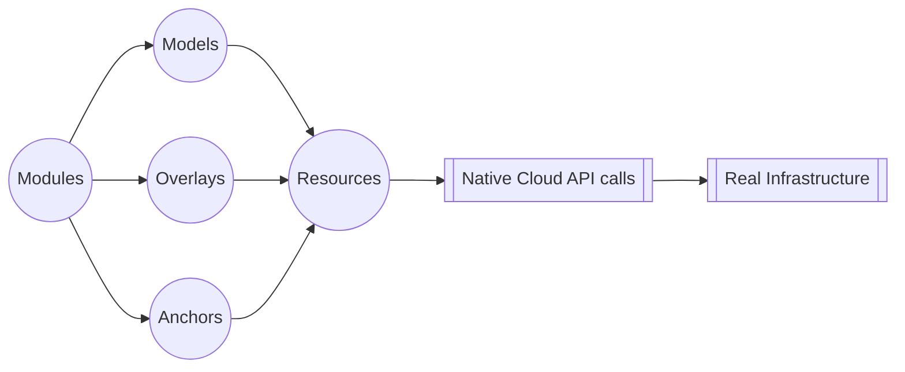
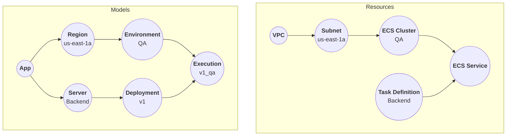

**Octo is a cloud agnostic, general purpose, cloud infrastructure modeling and management tool.**

Hello, and welcome to Octo ❤️<br />
Octo is a set of libraries that can help you model and maintain your infrastructure as code.
The libraries are TypeScript based, and follows a similar modular pattern to Angular or NestJs.

Octo has the capability to support multiple Cloud Providers,
though today it only provides limited support for AWS.
As our community grows, we expect to write CDKs for other providers as well, such as GCP and Azure.

There are many IaC tools - Terraform, AWS CDK, Pulumi, and others.
But Octo is different from its peers and is built from the ground up.<br/>
While other IaC tools interface with cloud resources directly,
Octo introduces the concept of **Models** - a set of higher order encapsulation of cloud resources that are
easy and more natural to understand.<br/>
On top of Models, we introduce another concept called **Modules** - an even higher order of encapsulation than
Models, which allows you to define and share infrastructure plug-and-play components which makes your infrastructure
even easier to conceptualize.

## Overview
Octo is a tool for modeling cloud infrastructure.
It layers the underlying infrastructure into Modules, Models, and Resources.

Here is how it works - you write modules, which generates models, which in turn creates infrastructure resources.
These resources then map to the real underlying infrastructure.
Each layer is translated into the next using Actions.<br/>
The final translation of resources to real infrastructure is done via Cloud APIs and SDKs.



This setup cleanly divides responsibilities between devops and developers.
Devops defines the building blocks that represents the infrastructure.
They define models, and resources, and the translation actions.<br/>
Developers write modules and shape the infrastructure and self-serve their needs
using a common understanding of these components.

## Example
Here's a pseudo Octo code of a **"Backend server running in QA environment"** in AWS infrastructure.

```typescript
const app = new App('my-app');

const region = new AwsRegion(AwsRegionId.AWS_US_EAST_1A);
app.addRegion(region);

const environment = new AwsEnvironment('QA');
region.addEnvironment(environment);

const server = new AwsServer('Backend');
app.addServer(server);

const deployment = new AwsDeployment('v1');
server.addDeployment(deployment);

new AwsExecution(deployment, environment);
```

* `App`, `Environment`, `Execution`, etc are all Models.
* Developers declare their infrastructure represented by the Model graph (below).
* Models are transformed into Resources, which logically represent the AWS infrastructure (below).
* Resources are transformed to AWS infrastructure using native AWS APIs.



## Benefits
* **Modeling Power**: Octo excels as a general-purpose cloud infrastructure modeling tool,
making modeling its greatest strength. By facilitating devops in creating clear and intuitive CDKs,
developers can logically write and test infrastructure changes.
* **Abstraction for Developers**: Developers are shielded from intricate low-level infrastructure details,
interacting solely with higher constructs.
* **Modules**: Octo introduces the concept of Modules - shareable and reusable infrastructure components.
* **TypeScript Advantage**: Being written in TypeScript, Octo inherits the benefits of TS,
including testing frameworks and the familiarity of one of the most widely used languages.
* **Graph Representation**: Octo depicts infrastructure as a Graph,
enabling visualization of infrastructure as a well-defined set of nodes and edges.
* **Detailed Understanding of Changes**: Any alterations to the infrastructure graph are differentially analyzed
at both Model and Resource levels, offering developers both simplified and detailed insights into the proposed changes.
* **Non Blocking Pipelines**: Being a graph, Octo understands the hierarchy and dependencies of resources.
Failure in one node won't block changes in other non-dependent nodes.
* **In-Built Testing**: Octo provides a testing framework that can help your write meaningful, intuitive, test cases
for your infrastructure.
* **Recovery from Failures**: Octo saves the state of resources after every run and keeps track of
infrastructure changes. Execution is stopped at failures, and upon re-run, it will pick up from the same point.
* **& more**: including Captures, and Events.
