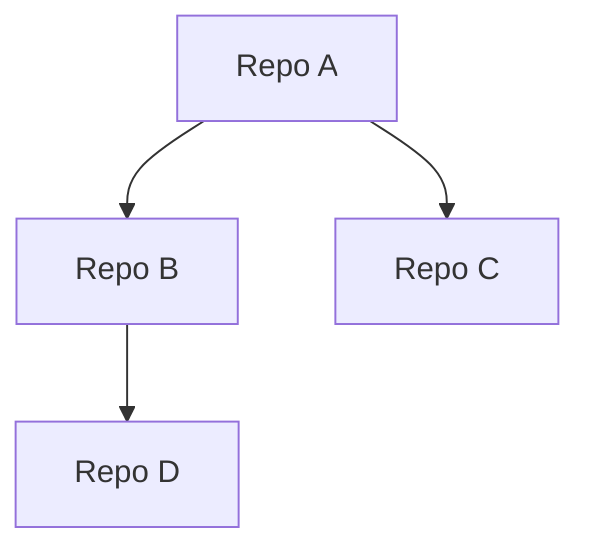
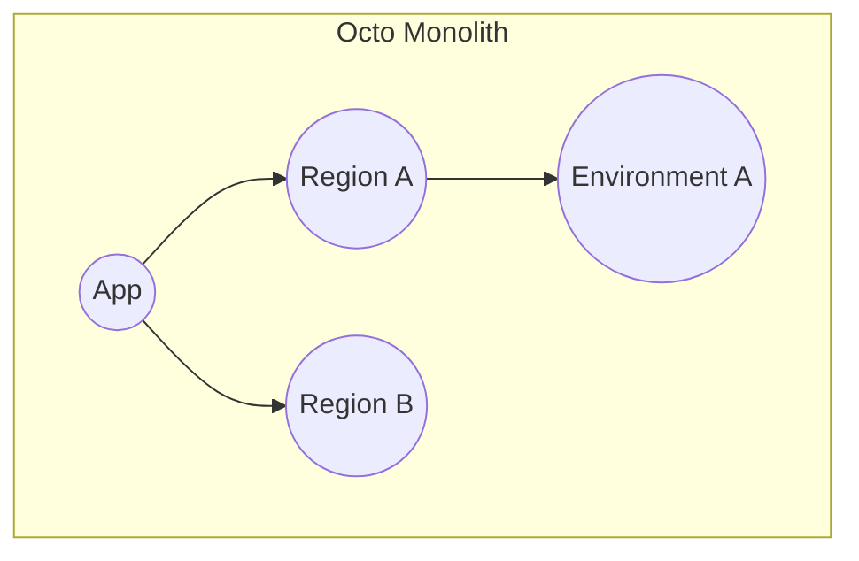
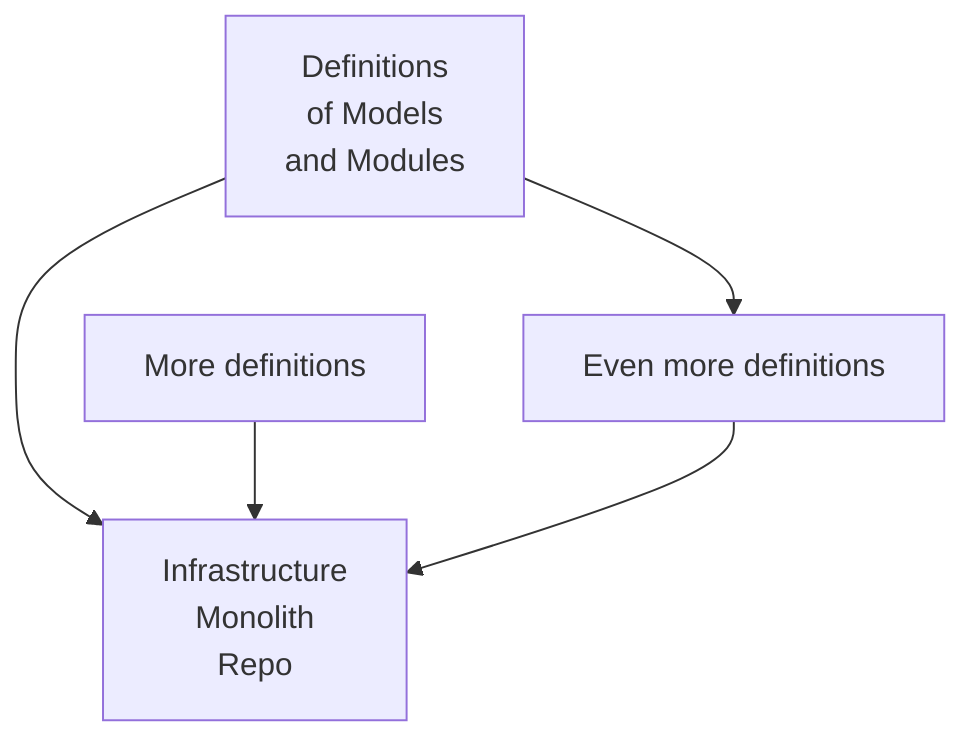

First and foremost, there are plenty of IaC tools available at your disposal, each one great in their own right.
Our aim with Octo, is not to compete, but is to present an alternative -
one that has an entirely different set of opinions and beliefs.

  
1. Infrastructure should be easy to understand, easy to build, and easy to change.

  

    We share this common belief, with every IaC provider, tool, and engineer,
    and materialize it with our abstractions and encapsulations of infrastructure.

    We must be confident in modifying our infrastructure, and for that we must embrace failures.
    Octo is very transparent in reporting failures, and provides techniques to safely get out of a weird situation.
  

  
2. DevOps should not be forced upon Developers.

  

    Developers are not DevOps, and vice-versa. Their job descriptions and domains differ.
    Their responsibilities differ. And yet, they must operate together.

    DevOps job should not be to make every infrastructure change for developers, or even to review every change.
    Likewise, developers cannot be expected to have deep understanding of infrastructure and self serve themselves.

    Octo provides that interface where these two mights can come together to collaborate,
    without interfering on each other's work.
  

  
3. If you cannot be shielded from infrastructure, might as well embrace it.

  

    No IaC tools, nor AI based products, can really shield you completely from your infrastructure.
    It's the hard truth!
    Think of all website generators that give you a nice UI to build a website. 
    Sure, you can generate one magically, but when things are running in Production, and something goes wrong,
    most often than not, you are on your own, and you need to understand the code in order to get out of that situation.

    Infrastructure is the same way. You must understand what you are building. 
    Octo is not magic. Its also not AI.
    It simply helps DevOps to create sane encapsulations that developers then try on.

    While other IaC tools forces you to deal with raw and overwhelming details of infrastructure at once,
    Octo bolsters your understanding of infrastructure layer by layer; shielding you from the deeper parts.
    How? You are aware of the entire encapsulated layers you are operating on at all times,
    and so you are free to dive as deep you want in the encapsulation layers as your comfortability allows.
  

  
4. Infrastructure is meant to be shared.

  

    Why is it that almost all infrastructure is built the same way - load balancing looks the same,
    caching looks the same, autoscaling policies look the same; and yet everyone has to build their own,
    and go through the same painstaking process.

    There are competing and parallel infrastructure techniques that might suit your use case better than the other,
    but there are only so many ways you can design a certain infrastructure module.

    Infrastructure should be shared, i.e. once you define a module,
    you should be able to reuse, or import someone else's, or even replace one module with another.
    Sure, the exact inputs to the module might change, but the essence of that module won't change,
    and that essence is what Octo allows to be defined.
  

## Monolith vs Monorepo
Octo only supports monolith infrastructure repository by design.
Having worked several years with large infrastructure code bases for several companies,
we realized monorepo doesn't bring the benefits when it comes to infrastructure, but rather makes it difficult.

Consider this monorepo layout, where every repository implements a part of the infrastructure.
But by nature, they are all part of the same ecosystem, and they must depend on each other. 
As higher repositories update their code base, it might lead to a dependency hell as all the children update themselves
to the latest version.

While monorepo designs have the benefit of isolation, i.e. failures and changes in Repo A
won't affect Repo B until they are committed,
the inter-dependency it creates can lead to more manual effort and leaves you open to errors.

Alternatively, consider the monolith design of infrastructure,

Having the entire infrastructure in one repository is less manual work, less error prone, less dispersed changes,
single source of truth, and promotes common understanding of the infrastructure. 
There are of course disadvantages to this approach too - mainly the possibility of blocking future pull requests
when the previous changes have failed to apply. But, in later section of the document we will talk about how Octo
deals with such situations.

## Developers vs DevOps
Unlike other IaC stacks, Octo recognizes the two factions of engineers - developers and devops.
The former excels in program and business logic, vs the latter in infrastructure details.
With current IaC tools, both are treated the same,
- or worse, developers are subjected to make changes on infrastructure resources that they don't fully understand,
which leads to half baked knowledge and mindless copy pasting of existing code, 
- or even more appalling option, where developers rely on devops for every infrastructure change,
which creates an unnecessary dependency.

Octo separates the two groups into their own spaces, where DevOps are tasked to generate Octo constructs -
such as definition of models, modules, resources, and such,
while Developers interface with these high level encapsulated constructs to create the final infrastructure.

## Monorepo in Octo
*Octo doesn't support monorepo* - at least not in the traditional sense.

Octo can have multiple definition repositories created by DevOps,
but only a single infrastructure repository. 
Definitions are created by DevOps, vs the infrastructure repository is where developers operate.

## Octo vs the rest
Octo is not a silver bullet to fit every need. Every tool has their place and benefits.
Whether to invest your time in Octo,
or look for alternatives depends on few crucial questions and your vision of your infrastructure. 
We will try to be as unbiased as possible 😉

- How familiar is your DevOps and Development team with infrastructure?
  - The more familiar, the more advanced tools you can use, since you understand everything.
- Are you okay to write and test your infrastructure in TypeScript?
  - We have currently no plans to support another language unfortunately, and so TypeScript is our only offering.
