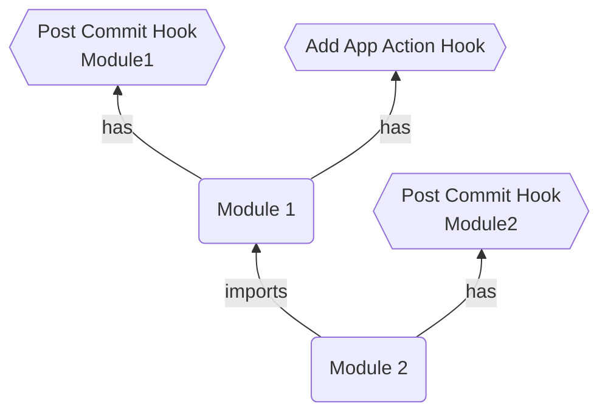

import Tabs from '@theme/Tabs';
import TabItem from '@theme/TabItem';

## Hooks
Modules support hooks - a sequence of callbacks triggered before or after specific events in Octo.
You can register callbacks for these transaction events within the module to execute custom code.

<Tabs>
  <TabItem value="CommitHooks" label="Commit Hooks" default>
    Pre/Post Commit Hooks allows you to take an action before or after the entire transaction is committed.
  </TabItem>
  <TabItem value="ModelHooks" label="Model Hooks" default>
    Pre/Post Model Hooks allows you to take an action before or after a model action runs.
  </TabItem>
  <TabItem value="ResourceHooks" label="Resource Hooks" default>
    Pre/Post Resource Hooks allows you to take an action before or after a resource action runs.
  </TabItem>
</Tabs>

## Example
Hooks can be registered inside [Modules](/docs/devops/create-module).
```typescript title="simple-app.module.ts"
@Module<SimpleAppModule>('@example', SimpleAppModuleSchema)
export class SimpleAppModule extends AModule<SimpleAppModuleSchema, App> {
  async onInit (inputs: SimpleAppModuleSchema): Promise<App> { ... }

  override registerHooks(): {
    postModelActionHooks?: {
      action: IModelAction<SimpleAppModule>;
      handle: (
        diff: Diff<App>,
        actionInputs: EnhancedModuleSchema<SimpleAppModule>,
        actionOutputs: ActionOutputs,
      ) => Promise<ActionOutputs>;
    }[];
    preCommitHooks?: {
      handle: (app: App, modelTransaction: DiffMetadata[][]) => Promise<void>;
    }[];
  } {
    return {
      postModelActionHooks: [
        {
          action: AddSimpleAppModelAction,
          handle: async (
            _diff: Diff<App>,
            _actionInputs: EnhancedModuleSchema<SimpleAppModule>,
            actionOutputs: ActionOutputs,
          ): Promise<ActionOutputs> => {
            console.log('I will trigger after AddSimpleAppModelAction runs!');
            return actionOutputs;
          },
        },
      ],
      preCommitHooks: [
        {
          handle: async (_app: App, _modelTransaction: DiffMetadata[][]): Promise<void> => {
            console.log('I will trigger before Octo commits the transaction!');
          },
        },
      ],
    };
  }
}
```

:::info
The `registerHooks()` method must return an object with one or more hooks names,
with each hook name containing an array of objects containing the hook's signature.
:::

## Types of Hooks
### preCommitHooks
Callbacks will execute just before the transaction is about to commit.<br/>
The signature includes a `handle()` callback method with below parameters.
```typescript
{
  handle: (
    app: App,
    modelTransaction: DiffMetadata[][],
    resourceTransaction: DiffMetadata[][] = [],
  ) => Promise<void>
}
```

### postCommitHooks
Callbacks will execute after the transaction is committed.<br/>
The signature includes a `handle()` callback method with below parameters.
```typescript
{
  handle: (
    app: App,
    modelTransaction: DiffMetadata[][],
    resourceTransaction: DiffMetadata[][] = [],
  ) => Promise<void>
}
```

### preModelActionHooks
Callbacks will execute just before the given model action is about to be executed.<br/>
The signature includes an `action`, and a `handle()` callback method with below parameters.
```typescript
{
  action: IModelAction<T extends UnknownModule>,
  handle: (
    diff: Diff<UnknownModel>,
    actionInputs: EnhancedModuleSchema<T extends UnknownModule>,
    actionOutputs: ActionOutputs,
  ) => Promise<ActionOutputs>,
}
```

### postModelActionHooks
Callbacks will execute after the given model action has executed.<br/>
The signature includes an `action`, and a `handle()` callback method with below parameters.
```typescript
{
  action: IModelAction<T extends UnknownModule>,
  handle: (
    diff: Diff<UnknownModel>,
    actionInputs: EnhancedModuleSchema<T extends UnknownModule>,
    actionOutputs: ActionOutputs,
  ) => Promise<ActionOutputs>,
}
```

### preResourceActionHooks
Callbacks will execute just before the given resource action is about to be executed.<br/>
The signature includes an `action`, and a `handle()` callback method with below parameters.
```typescript
{
  action: IResourceAction<T extends UnknownResource>,
  handle: (diff: Diff) => Promise<void>;
}
```

### postResourceActionHooks
Callbacks will execute after the given resource action has executed.<br/>
The signature includes an `action`, and a `handle()` callback method with below parameters.
```typescript
{
  action: IResourceAction<T extends UnknownResource>,
  handle: (diff: Diff) => Promise<void>;
}
```

## Order of Execution
Hooks are bound to Modules, and since modules have a hierarchy, hook registration follows that hierarchy.



In above diagram, both module1 and module2 contains a post commit hook.
Since module1 is registered first based on hierarchy,
the post commit hooks of module1 will be executed before module2's post commit hooks.

Similarly, if a module has multiple action hooks of same type on the same action,
they will be executed as per the order you provide in the array.
