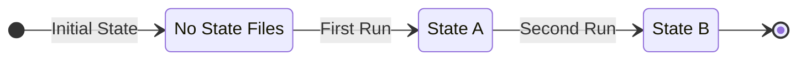
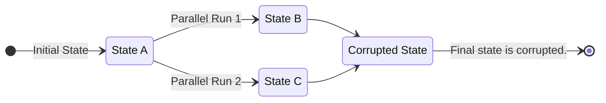
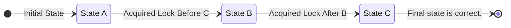

## Introduction
In Octo, State Providers are special classes equipped to handle Octo states - such as persisting them,
fetching them back to be passed to Octo program for `diffs`, and managing locks.

Octo comes pre-bundled with many state providers, each with their own qualities.
Or, you can create your own custom ones.

Some state providers are designed to work locally, and some manages the state remotely.
It really depends on how you plan on using Octo in the long term.

## State Management
*Why state needs to be managed?*

Octo does not have databases. Instead, it has states - files to keep track of infrastructure models and resources.
After each run, Octo saves a full report of what it did, and what the state of your cloud infrastructure is.
These files are referenced back on every subsequent runs for Octo to identify the infrastructure diff.

In a typical flow, you start with no states.
The first time Octo runs, it will add new infrastructure resources and produce `State A`.
When you run Octo the second time, it will take `State A`, generate new diffs, perform those actions,
and will generate `State B`.

Naturally, Octo needs the state files to be persisted, and that is the job of a State Provider.

## Types of State Providers
States can be persisted in-memory, in local filesystems, remotely, in storage buckets like AWS S3, and so on.
It does not matter to Octo how the state is persisted, as long as it gets the state before every run.

Without prior states, Octo will behave as if it is running for the first time, and it will try to
add the same resources again and again in infrastructure, which is not good!

Octo comes pre-bundled with several state providers,
- [TestStateProvider](/api/octo/class/TestStateProvider): A TestStateProvider stores the state in memory.
It is typically used to write tests, and once the tests are done, the state is discarded.
- [LocalStateProvider](/api/octo/class/LocalStateProvider): A LocalStateProvider stores the state in local filesystem.
It is a very handy provider when experimenting with Octo locally.
- [LocalEncryptionStateProvider](/api/octo/class/LocalEncryptionStateProvider): A LocalEncryptionStateProvider is
very similar to the LocalStateProvider, with the only difference that it encrypts the state so that files can
be committed to a version control system like GitHub.

:::info
We are in process of releasing a remote state provider - `OctoRemoteStateProvider` which will have the ability
to save the state in Cloud. This feature will require you to create a new account in Octo UI.
:::

## Parallel Runs and Octo State
As already discussed, Octo requires the previous state to build the new state.

When multiple developers are making changes to infrastructure using Octo, e.g. merging of multiple pull requests,
managing states gets very complicated.
If multiple changes try to run at the same time, both might fetch the same state and interfere with one another.
Instead of applying on top of each other, they will overwrite each other, and will most definitely corrupt the state.

## State Locks
To support multiple changes, state providers supports Locks.
A lock allows only one Octo execution to take place at a time - the other executions wait for their turn.
This keeps the flow of executions linear, and allows each change to be persisted in the state before another
change can take place.

As you can imagine, just placing a lock is not enough.
All Octo executions also needs to be able to detect a lock is in place, and have a mechanism to wait to acquire locks.
This implies managing locks in a central location.

When working with local state providers like `TestStateProvider`, `LocalStateProvider`,
or `LocalEncryptionStateProvider`, it is not possible to place a lock in a central location.
Thus, local state providers are only meant to work in environments where only one execution takes place at a time,
e.g. in your local machine.

To support real world scenarios, like infrastructure changes in multiple pull requests,
you need to use a remote state provider, such as `OctoRemoteStateProvider`.
These remote state providers can store the lock in cloud and can reliably implement wait mechanisms to enqueue
subsequent Octo executions.
